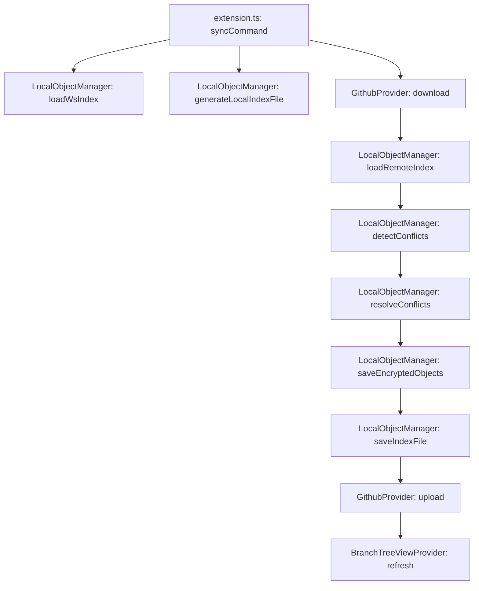
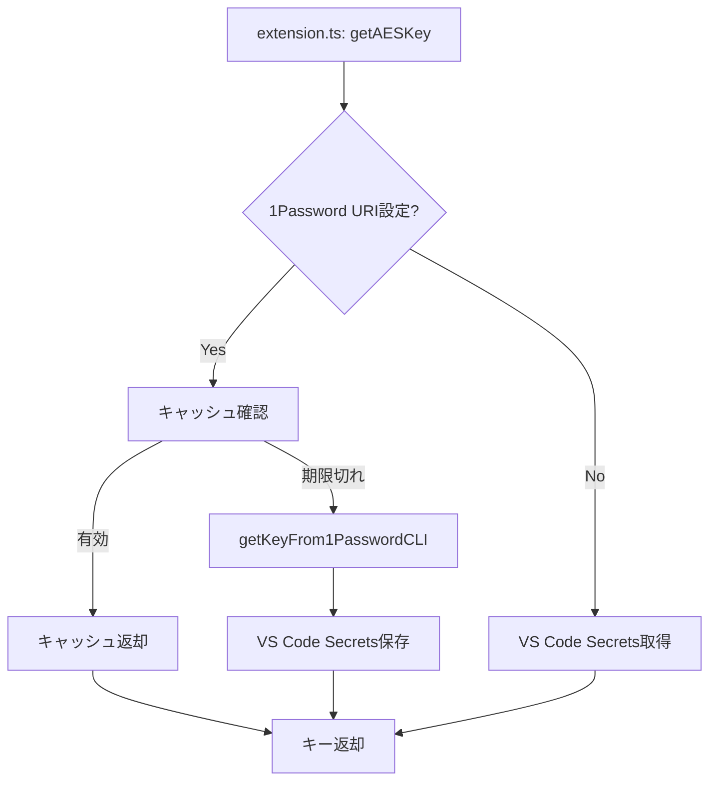

# Secure Notes Sync - ソースコード機能マッピング

このドキュメントは、`spec.md`で定義された機能と実際のソースコードファイルの対応関係を可視化したものです。

## 📁 ファイル構成と役割

### 🎯 コア構成要素

| 機能 | ファイル | 主な責務 |
|------|----------|----------|
| **拡張機能エントリポイント** | `src/extension.ts` | コマンド登録、イベント処理、AESキー管理、拡張機能の活性化・非活性化 |
| **ローカルオブジェクト管理** | `src/storage/LocalObjectManager.ts` | 暗号化・復号化、インデックス管理、競合解決、ファイル同期処理 |
| **GitHub同期プロバイダ** | `src/storage/GithubProvider.ts` | Git操作によるリモート同期（fetch/merge/push） |
| **ブランチツリービュー** | `src/BranchTreeViewProvider.ts` | UI表示とブランチ操作（TreeView実装） |
| **ロガー** | `src/logger.ts` | ターミナル出力とエラー管理（ANSIカラー対応） |

### 📋 データ構造定義

| 要素 | ファイル | 内容 |
|------|----------|------|
| **型定義** | `src/types.ts` | `IndexFile`, `FileEntry`, `UpdateFiles`インターフェース |
| **ストレージインターフェース** | `src/storage/IStorageProvider.ts` | ストレージプロバイダの共通インターフェース |

---

## 🔧 主要機能の実装マッピング

### 1. 拡張機能の初期化と活性化

**spec.md 該当箇所**: 「拡張機能の初期化と活性化」

| 処理 | 実装ファイル | 実装関数/メソッド |
|------|-------------|------------------|
| 活性化条件チェック | `package.json` | `activationEvents` |
| 初期化処理 | `src/extension.ts` | `activate()` |
| 環境ID生成 | `src/extension.ts` | `getOrCreateEnvironmentId()` |
| ログターミナル作成 | `src/logger.ts` | `showOutputTerminal()` |
| コマンド登録 | `src/extension.ts` | `vscode.commands.registerCommand()` |
| ブランチツリービュー初期化 | `src/BranchTreeViewProvider.ts` | `constructor()` |

### 2. AESキー管理システム

**spec.md 該当箇所**: 「AESキー管理システム」

| 処理 | 実装ファイル | 実装関数/メソッド |
|------|-------------|------------------|
| キー取得（統合） | `src/extension.ts` | `getAESKey()` |
| 1Password CLI連携 | `src/extension.ts` | `getKeyFrom1PasswordCLI()` |
| キャッシュ管理 | `src/extension.ts` | `getAESKey()` 内のキャッシュロジック |
| キー生成 | `src/extension.ts` | `generateAESKeyCommand` |
| 手動設定 | `src/extension.ts` | `setAESKeyCommand` |
| キーリフレッシュ | `src/extension.ts` | `refreshAESKeyCommand` |
| クリップボードコピー | `src/extension.ts` | `copyAESKeyCommand` |

### 3. 暗号化・復号化システム

**spec.md 該当箇所**: 「暗号化・復号化システム」

| 処理 | 実装ファイル | 実装関数/メソッド |
|------|-------------|------------------|
| AES-256-CBC暗号化 | `src/storage/LocalObjectManager.ts` | `encryptContent()` |
| AES-256-CBC復号化 | `src/storage/LocalObjectManager.ts` | `decryptContent()` |
| ファイル暗号化保存 | `src/storage/LocalObjectManager.ts` | `saveEncryptedObjects()` |
| ファイル復号化読み込み | `src/storage/LocalObjectManager.ts` | `decryptFileFromLocalObject()` |
| ハッシュベースパス生成 | `src/storage/LocalObjectManager.ts` | `getHashPathParts()`, `getHashFilePathUri()` |

### 4. ファイル同期システム

**spec.md 該当箇所**: 「ファイル同期システム」

| 処理 | 実装ファイル | 実装関数/メソッド |
|------|-------------|------------------|
| 同期処理メイン | `src/extension.ts` | `syncCommand` |
| ローカルインデックス生成 | `src/storage/LocalObjectManager.ts` | `generateLocalIndexFile()` |
| 競合検出 | `src/storage/LocalObjectManager.ts` | `detectConflicts()` |
| 競合解決 | `src/storage/LocalObjectManager.ts` | `resolveConflicts()` |
| インデックスマージ | `src/storage/LocalObjectManager.ts` | `mergeIndexes()` |
| ファイル変更反映 | `src/storage/LocalObjectManager.ts` | `reflectFileChanges()` |
| wsIndex保存 | `src/storage/LocalObjectManager.ts` | `saveWsIndexFile()` |
| インデックス保存 | `src/storage/LocalObjectManager.ts` | `saveIndexFile()` |

### 5. GitHub同期プロバイダ

**spec.md 該当箇所**: 「GitHub同期プロバイダ」

| 処理 | 実装ファイル | 実装関数/メソッド |
|------|-------------|------------------|
| リモートダウンロード | `src/storage/GithubProvider.ts` | `download()` |
| リモートアップロード | `src/storage/GithubProvider.ts` | `upload()` |
| Gitリポジトリ初期化 | `src/storage/GithubProvider.ts` | `initializeGitRepo()` |
| ブランチチェックアウト | `src/storage/GithubProvider.ts` | `checkoutBranch()` |
| リモートブランチ存在確認 | `src/storage/GithubProvider.ts` | `remoteBranchExists()` |
| Gitコマンド実行 | `src/storage/GithubProvider.ts` | `execCmd()` |
| Git実行ファイル検索 | `src/storage/GithubProvider.ts` | `findGitExecutable()` |

### 6. ブランチ管理システム

**spec.md 該当箇所**: 「ブランチ管理システム」

| 処理 | 実装ファイル | 実装関数/メソッド |
|------|-------------|------------------|
| ブランチ一覧表示 | `src/BranchTreeViewProvider.ts` | `getBranchList()` |
| インデックス履歴表示 | `src/BranchTreeViewProvider.ts` | `getIndexHistoryOfBranch()` |
| ブランチ作成 | `src/extension.ts` | `createBranchFromIndex` |
| ブランチチェックアウト | `src/extension.ts` | `checkoutBranch` |
| ブランチ参照保存 | `src/storage/LocalObjectManager.ts` | `saveBranchRef()` |
| ブランチ参照読み込み | `src/storage/LocalObjectManager.ts` | `readBranchRef()` |
| 現在ブランチ名取得 | `src/storage/LocalObjectManager.ts` | `getCurrentBranchName()` |
| 現在ブランチ名設定 | `src/storage/LocalObjectManager.ts` | `setCurrentBranchName()` |

### 7. 自動同期システム

**spec.md 該当箇所**: 「自動同期システム」

| 処理 | 実装ファイル | 実装関数/メソッド |
|------|-------------|------------------|
| ウィンドウフォーカス監視 | `src/extension.ts` | `vscode.window.onDidChangeWindowState()` |
| ファイル保存監視 | `src/extension.ts` | `vscode.workspace.onDidSaveTextDocument()` |
| 遅延同期タイマー | `src/extension.ts` | `saveSyncTimeout` 変数 |
| 非アクティブ時間計算 | `src/extension.ts` | `lastWindowActivationTime` 変数 |

### 8. ログ・エラー管理システム

**spec.md 該当箇所**: 「ログ・エラー管理システム」

| 処理 | 実装ファイル | 実装関数/メソッド |
|------|-------------|------------------|
| ターミナル作成 | `src/logger.ts` | `showOutputTerminal()` |
| 疑似ターミナル実装 | `src/logger.ts` | `MyPseudoterminal` クラス |
| ログ出力 | `src/logger.ts` | `logMessage()` |
| カラーログ出力 | `src/logger.ts` | `logMessageRed()`, `logMessageGreen()`, etc. |
| エラー通知 | `src/logger.ts` | `showError()` |
| 情報通知 | `src/logger.ts` | `showInfo()` |
| タイムスタンプ生成 | `src/logger.ts` | `getLocalISOStringWithOffset()` |

---

## 🎮 利用可能なコマンド実装

**spec.md 該当箇所**: 「利用可能なコマンド」

| コマンド | 実装ファイル | 実装変数名 |
|----------|-------------|-----------|
| `extension.generateAESKey` | `src/extension.ts` | `generateAESKeyCommand` |
| `extension.setAESKey` | `src/extension.ts` | `setAESKeyCommand` |
| `extension.syncNotes` | `src/extension.ts` | `syncCommand` |
| `extension.refreshAESKey` | `src/extension.ts` | `refreshAESKeyCommand` |
| `extension.copyAESKeyToClipboard` | `src/extension.ts` | `copyAESKeyCommand` |
| `extension.insertCurrentTime` | `src/extension.ts` | `insertCurrentTimeCommand` |
| `extension.createBranchFromIndex` | `src/extension.ts` | `createBranchFromIndex` |
| `extension.checkoutBranch` | `src/extension.ts` | `checkoutBranch` |

---

## 📊 データフロー図

### 同期処理のデータフロー

### AESキー取得のデータフロー

---

## 🔧 設定項目とファイル対応

**spec.md 該当箇所**: 「設定項目」

| 設定項目 | 使用ファイル | 使用箇所 |
|----------|-------------|----------|
| `SecureNotesSync.gitRemoteUrl` | `src/extension.ts` | `syncCommand` 内 |
| `SecureNotesSync.enableAutoSync` | `src/extension.ts` | イベントリスナー内 |
| `SecureNotesSync.inactivityTimeoutSec` | `src/extension.ts` | ウィンドウフォーカス処理 |
| `SecureNotesSync.saveSyncTimeoutSec` | `src/extension.ts` | ファイル保存処理 |
| `SecureNotesSync.onePasswordUri` | `src/extension.ts` | `getAESKey()` 内 |
| `SecureNotesSync.onePasswordAccount` | `src/extension.ts` | `getAESKey()` 内 |
| `SecureNotesSync.onePasswordCacheTimeout` | `src/extension.ts` | `getAESKey()` 内 |

---

## 📁 ディレクトリ構造とファイル対応

**spec.md 該当箇所**: 「ディレクトリ構造」

| ディレクトリ/ファイル | 管理ファイル | 関連関数 |
|---------------------|-------------|----------|
| `.secureNotes/HEAD` | `src/storage/LocalObjectManager.ts` | `getCurrentBranchName()`, `setCurrentBranchName()` |
| `.secureNotes/wsIndex.json` | `src/storage/LocalObjectManager.ts` | `loadWsIndex()`, `saveWsIndexFile()` |
| `.secureNotes/remotes/refs/` | `src/storage/LocalObjectManager.ts` | `saveBranchRef()`, `readBranchRef()` |
| `.secureNotes/remotes/indexes/` | `src/storage/LocalObjectManager.ts` | `loadIndex()`, `saveIndexFile()` |
| `.secureNotes/remotes/files/` | `src/storage/LocalObjectManager.ts` | `saveEncryptedObjects()`, `decryptFileFromLocalObject()` |

---

## 🎨 UI コンポーネント

| UI要素 | 実装ファイル | 実装クラス/関数 |
|--------|-------------|----------------|
| ブランチツリービュー | `src/BranchTreeViewProvider.ts` | `BranchTreeViewProvider` クラス |
| ブランチアイテム | `src/BranchTreeViewProvider.ts` | `BranchItem` クラス |
| インデックスアイテム | `src/BranchTreeViewProvider.ts` | `IndexItem` クラス |
| ログターミナル | `src/logger.ts` | `MyPseudoterminal` クラス |

---

## 🔒 セキュリティ機能

**spec.md 該当箇所**: 「セキュリティ考慮事項」

| セキュリティ機能 | 実装ファイル | 実装箇所 |
|-----------------|-------------|----------|
| AES-256-CBC暗号化 | `src/storage/LocalObjectManager.ts` | `encryptContent()` |
| ランダムIV生成 | `src/storage/LocalObjectManager.ts` | `encryptContent()` 内 |
| SHA-256ハッシュ計算 | `src/storage/LocalObjectManager.ts` | `generateLocalIndexFile()` 内 |
| VS Code Secrets API | `src/extension.ts` | `getAESKey()`, コマンド内 |
| 1Password CLI連携 | `src/extension.ts` | `getKeyFrom1PasswordCLI()` |

---

## 📈 パフォーマンス最適化

**spec.md 該当箇所**: 「パフォーマンス最適化」

| 最適化機能 | 実装ファイル | 実装箇所 |
|-----------|-------------|----------|
| ハッシュベース重複排除 | `src/storage/LocalObjectManager.ts` | `saveEncryptedObjects()` 内 |
| ディレクトリ分割 | `src/storage/LocalObjectManager.ts` | `getHashPathParts()`, `getUUIDPathParts()` |
| タイムスタンプ最適化 | `src/storage/LocalObjectManager.ts` | `generateLocalIndexFile()` 内 |
| AESキーキャッシュ | `src/extension.ts` | `getAESKey()` 内 |

---

このマッピングにより、spec.mdで定義された各機能がどのソースファイルのどの関数で実装されているかが明確になります。新機能の追加や既存機能の修正時に、このドキュメントを参照することで効率的な開発が可能になります。