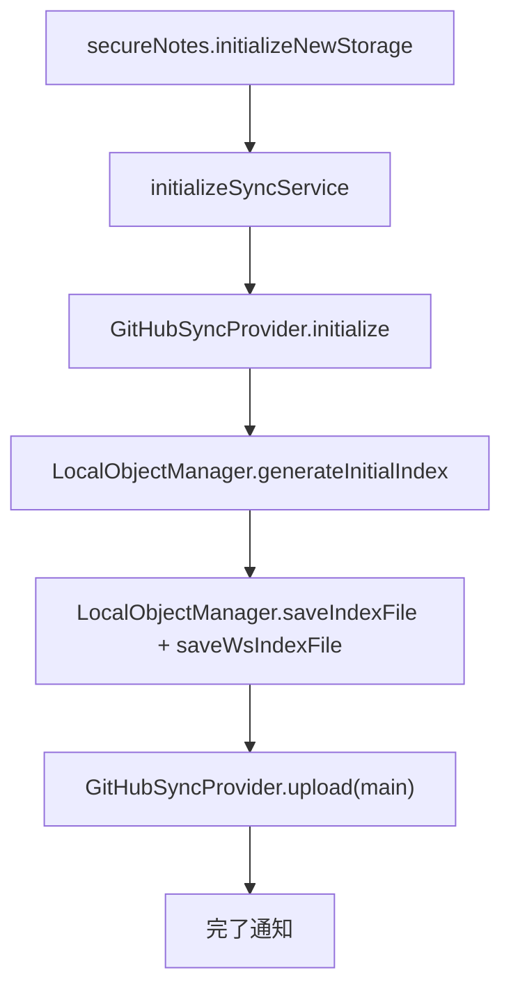
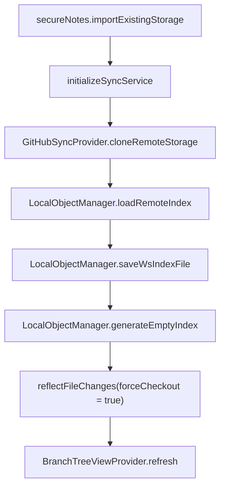
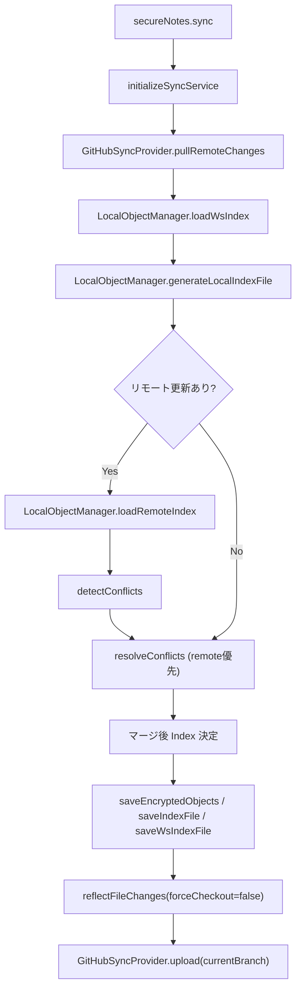
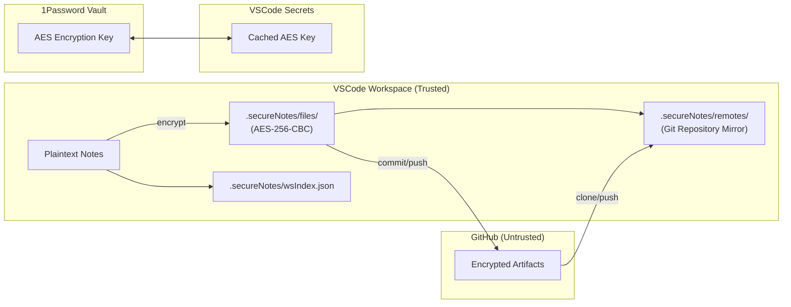

# Secure Notes Sync - 動作仕様書

## 概要

Secure Notes Sync は VS Code 拡張機能として動作し、ワークスペース内の機密ノートを AES-256-CBC で暗号化した上で GitHub リポジトリへ同期します。ローカル状態は `.secureNotes/` 配下に保存され、Git は暗号化済みアーティファクトの転送にのみ使用します。1Password CLI との連携による鍵管理、ブランチ／インデックスの可視化、ファイル保存やウィンドウアクティベーションに連動した自動同期を提供します。

## 設計思想

Secure Notes Sync は「**ローカル主権・明示的暗号化・Gitによる可観測な同期**」という3つの原則に基づいて設計されています。

### 1. ローカル主権

- すべてのノートデータの平文は VSCode ワークスペース内にのみ存在します。
- GitHub リポジトリやクラウドストレージは「暗号化済みバイナリ転送層」としてのみ利用され、信頼を前提としません。
- ユーザーは `.secureNotes/` ディレクトリを完全に削除すれば、任意の時点で安全にデータを破棄できます。

この構成により、クラウド事業者・GitHub アカウント漏洩・リポジトリ共同管理者など、
外部要因による情報流出リスクを**暗号層で遮断**します。

### 2. 明示的暗号化

- 暗号化はアプリ内部で透過的に行われますが、ユーザーの認知下で「いつ・何が・どの鍵で」暗号化されるかを明示します。
- AES-256-CBC を採用し、各ファイルごとに独立した IV を生成して保存。再暗号化によるキー更新も容易です。
- 鍵の管理は VSCode Secrets API と 1Password CLI のいずれかを選択可能で、ユーザー自身のセキュリティモデルに適合します。

この「明示的暗号化」は「信頼できるアプリではなく、**信頼しなくても安全な構造**」を目指しています。

### 3. Git による可観測な同期

- Git のコミット履歴がすなわち**暗号化オブジェクトの監査証跡**になります。
- 各同期は独立した IndexFile (UUIDv7) によって識別され、履歴の復元や差分確認が容易です。
- 競合処理や分岐履歴を Git の仕組みと整合的に扱うことで、拡張性と信頼性を両立します。

---

## アーキテクチャ概要

### コアコンポーネント

- `src/extension.ts`: 拡張機能エントリポイント。DI コンテナ初期化、AES 鍵取得、コマンド／イベント登録、ツリービュー構築、自動同期トリガー設定を担当。
- `src/container/`: 依存性注入実装。`ContainerBuilder` が既定サービスを登録し、`ServiceLocator` が解決を提供。
- `src/config/ConfigManager.ts`: VS Code 設定から同期設定 (`SyncConfig`) を生成し、環境 ID を `globalState` に永続化。
- `src/SyncService.ts`: 同期オーケストレーション。新規初期化、既存取り込み、増分同期、競合処理、アップロードまでを統合。
- `src/storage/LocalObjectManager.ts`: インデックス生成／保存、暗号化／復号、コンフリクト対応、ブランチ参照管理、ワークスペース反映を担う。
- `src/storage/GithubProvider.ts`: `.secureNotes/remotes` を Git リポジトリとして操作し、`git init/clone/fetch/reset/add/commit/push` を実行。
- `src/factories/SyncServiceFactory.ts`: 設定に基づき `GitHubSyncProvider` と `SyncService` を構築。現在は GitHub ストレージのみサポート。
- `src/BranchTreeViewProvider.ts` / `src/IndexHistoryProvider.ts`: ブランチ一覧とインデックス履歴の TreeView を提供。
- `src/logger.ts`: 拡張専用ターミナルへのログ出力と VS Code 通知 API のラッパー。

### 依存性注入

- `ServiceContainer`: シングルトン／トランジェントを管理。
- `ContainerBuilder.buildDefault(context)`: SyncServiceFactory・ConfigManager・BranchTreeViewProvider などを登録。`LocalObjectManager` は初期化時に遅延登録。
- `ServiceLocator`: `getConfigManager()`, `getSyncServiceFactory()`, `getBranchProvider()` などで型安全に取得し、`dispose()` でリソースを解放。

## データ構造と永続化

### TypeScript 定義 (`src/types.ts`)

```ts
interface FileEntry {
  path: string;
  hash: string; // 平文データの SHA-256
  timestamp: number;
  deleted?: boolean;
}

interface IndexFile {
  uuid: string; // UUID v7
  environmentId: string;
  parentUuids: string[];
  files: FileEntry[];
  timestamp: number;
}

type LocalObjectManagerOptions = {
  environmentId: string;
  encryptionKey: string;
};
```

### `.secureNotes/` ディレクトリ

```
.secureNotes/
├── HEAD                 # 現在のブランチ名（平文）
├── wsIndex.json         # 最新インデックス（平文 JSON）
└── remotes/
    ├── refs/<branch>    # ブランチ最新 Index UUID を AES で暗号化したバイナリ
    ├── indexes/         # IndexFile を AES で暗号化し保存（UUID 先頭6文字で分割）
    │   └── 01a2b3/xxxx  # 各ファイルは JSON の暗号化バイナリ
    └── files/           # 暗号化済みファイルのバイナリ（ハッシュ先頭2文字で分割）
```

暗号データは `[IV(16byte)][Ciphertext]` で保存し、IV はファイルごとに生成します。Hash 先頭2文字／UUID 先頭6文字でディレクトリを分割してファイル数を抑制します。

競合発生時の退避ファイルはワークスペース直下に作成され、ローカル変更を `conflict-local/<YYYY-MM-DD_HH-mm-ss-SSS>/`、リモート変更を `conflict-remote/<YYYY-MM-DD_HH-mm-ss-SSS>/` に配置します。両者のタイムスタンプは JST (UTC+9) で生成され、1 回の同期中は同一フォルダにまとめられます。`conflict-local/` はローカルインデックス生成時の除外パスに追加されており、再同期で誤ってアップロードされません。

## 活性化とコマンド

### 拡張機能起動フロー

1. `activate()` 内でログ用ターミナルを開く (`showOutputTerminal`)。
2. `ContainerBuilder.buildDefault` を実行し DI を初期化。
3. AES 鍵を取得できた場合は `LocalObjectManager` を即時登録。
4. ブランチ／インデックスビューを作成し TreeView を公開。
5. 同期・鍵操作・ブランチ操作などのコマンドを登録。
6. `setupAutoSyncListeners()` で自動同期イベント (ウィンドウフォーカス／保存イベント) を設定。

### 提供コマンド（主要）

| コマンド ID                                                                            | 概要                             | 主な呼び出し先                                            |
| -------------------------------------------------------------------------------------- | -------------------------------- | --------------------------------------------------------- |
| `secureNotes.initializeNewStorage`                                                     | 新規ストレージ初期化             | `SyncService.initializeNewStorage`                        |
| `secureNotes.importExistingStorage`                                                    | 既存リモート取込                 | `SyncService.importExistingStorage`                       |
| `secureNotes.sync`                                                                     | 増分同期                         | `SyncService.performIncrementalSync`                      |
| `secureNotes.setAESKey` / `generateAESKey` / `copyAESKeyToClipboard` / `refreshAESKey` | AES 鍵操作                       | `extension.ts` 内ユーティリティ                           |
| `secureNotes.createBranchFromIndex` / `checkoutBranch`                                 | ブランチ管理                     | `LocalObjectManager.saveBranchRef` / `reflectFileChanges` |
| `secureNotes.previewIndex`                                                             | インデックス JSON をエディタ表示 | `IndexHistoryProvider`                                    |

## AES 鍵管理

- `config.getOnePasswordUri()` が `op://` を返す場合は 1Password CLI (`op`) を使用。`getOnePasswordAccount()` が設定されていれば `--account` を付与。
- キャッシュは `context.secrets` に保存し、取得時刻 (`aesEncryptionKeyFetchedTime`) と `onePasswordCacheTimeout` (既定 30 日、`5m` などの書式) を比較。
- CLI から取得できない場合や `op://` が未設定の場合は Secrets API に保存済みの鍵を返却。
- 鍵は 32 バイト (64 hex) を期待し、`initializeSyncService` でバリデーションを実施。

## 同期フロー

### 新規リポジトリ初期化 (`initializeNewStorage`)



- `initialize()` は `.secureNotes/remotes` を初期化し、`.gitattributes` を `* binary` で作成。
- Index はローカルファイルを再帰スキャンし SHA-256 を計算、削除検出は `deleted: true` で表現。
- `upload()` は差分がある場合のみ `git add .` → `git commit -m commit` → `git push origin main` を実行。

### 既存リポジトリ取り込み (`importExistingStorage`)



- `cloneRemoteStorage()` は `.secureNotes/remotes` を削除後に `git clone <remote> remotes` を実行。
- `loadRemoteIndex()` は `refs/main` を復号し、`indexes/<uuid>` を復号して最新 Index を得る。
- `reflectFileChanges(forceCheckout=true)` で暗号化済みファイルからワークスペースへ復元し、`setCurrentBranchName()` で `HEAD` を更新。

### 増分同期 (`performIncrementalSync`)



- `pullRemoteChanges()` は `git fetch origin` 後、`git rev-parse HEAD` と `origin/main` を比較し差分があれば `git reset --hard origin/main`。
- `detectConflicts()` はローカル／前回インデックス／リモートインデックスの差分を比較し、更新／削除／追加を分類。
- `resolveConflicts()` はリモート優先。ローカル変更は `conflict-local/<YYYY-MM-DD_HH-mm-ss-SSS>/<path>` に退避し、JST(UTC+9) 基準で一度の同期につき共通ディレクトリを使用する。リモート側との差分は `conflict-remote/<YYYY-MM-DD_HH-mm-ss-SSS>/<path>` に保存し、削除競合は `deleted-<timestamp>/` へ退避。
- `saveEncryptedObjects()` は新規／更新／削除を評価し、暗号化ファイル (`files/`) と削除処理を行う。
- `finalizeSync()` で `BranchTreeViewProvider.refresh()` を呼び出し、`upload()` を実行。

## ブランチ・インデックス管理

- `saveBranchRef(branch, uuid)` は参照ファイルを AES で暗号化して保存。`readBranchRef` は復号して UUID を返す。
- `setCurrentBranchName(branch)` が `.secureNotes/HEAD` を更新し、`getCurrentBranchName()` は存在しない場合 `main` を返す。
- `BranchTreeViewProvider` は `.secureNotes/remotes/refs` を読み込み、インデックス UUID とタイムスタンプを表示。
- `IndexHistoryProvider` は `loadRemoteIndexes()` で最大 30 件のインデックスを復号し、`secureNotes.previewIndex` コマンドで JSON を表示。

## 自動同期

- `enableAutoSync` (boolean) が有効な場合のみ動作。
- ウィンドウフォーカス: `onDidChangeWindowState` で復帰時の不在時間を計測し、`inactivityTimeoutSec` 超過で `secureNotes.sync` を呼び出す。
- ファイル保存: `onDidSaveTextDocument` で遅延タイマー (`saveSyncTimeoutSec` 秒) をセットし、連続保存時はリセット。

## GitHub プロバイダー詳細 (`GitHubSyncProvider`)

- Git 実行ファイルは `which` で検索。未検出の場合はプラットフォーム別の既知パスをチェック。
- `initialize()`:
  - `git ls-remote` でリモート状態を確認。未作成 or 空を判定し、それぞれ `initializeNewRemoteRepository()` / `initializeEmptyRemoteRepository()` を呼び分け。
  - `.gitattributes` を `* binary` で生成し、`git init`, `git remote add origin`, `git checkout -b main` を実行。
- `cloneRemoteStorage()`:
  - 既存ディレクトリを削除後、親ディレクトリで `git clone <url> remotes` を実行。
- `pullRemoteChanges()`:
  - `git fetch origin`, `git rev-parse` で差分確認、更新があれば `git reset --hard origin/main`。
- `upload(branch)`:
  - `git checkout branch` (存在しなければ作成)、`git add .`、変更があればコミット・プッシュ。
- すべての Git コマンドは `execFile` を使用し、標準出力・標準エラーをログへ送る。

## ログとエラー処理

- `logMessage*` 系は専用ターミナルへ色付き出力。`showInfo` / `showError` が VS Code の通知を表示。
- 主要コマンドは `executeSyncOperation` を通じて例外を捕捉し、失敗時は false を返して UI へ一貫したメッセージを表示。
- `registerManualSyncTestCommand` (開発用) で手動テストコマンドを追加可能。

## 設定項目 (`package.json` / `src/config.ts`)

| 設定キー                                  | 型 / 既定値 | 説明                                               |
| ----------------------------------------- | ----------- | -------------------------------------------------- |
| `SecureNotesSync.gitRemoteUrl`            | string      | 同期先 GitHub リポジトリ URL。必須。               |
| `SecureNotesSync.enableAutoSync`          | false       | 自動同期の有効／無効。                             |
| `SecureNotesSync.inactivityTimeoutSec`    | 60          | フォーカス復帰後に同期するまでの非アクティブ秒数。 |
| `SecureNotesSync.saveSyncTimeoutSec`      | 5           | ファイル保存後に同期するまでの遅延秒数。           |
| `SecureNotesSync.onePasswordUri`          | string      | 1Password CLI で読み取る項目 (`op://` 形式)。      |
| `SecureNotesSync.onePasswordAccount`      | string      | `op` コマンドに渡すアカウント名 (任意)。           |
| `SecureNotesSync.onePasswordCacheTimeout` | `30d`       | CLI 取得結果のキャッシュ期間 (例: `5m`, `12h`)。   |

以上が現在実装されている Secure Notes Sync の仕様です。実装と差異が生じた場合は本ドキュメントを更新し、`source-code-mapping.md` など関連資料も合わせてメンテナンスしてください。

## セキュリティモデル

### トラスト境界

以下の図は Secure Notes Sync における信頼境界のモデルを示します。



#### 信頼分類

| コンポーネント         | 信頼レベル                                   | 主なリスク                     | 対応策                                   |
| ---------------------- | -------------------------------------------- | ------------------------------ | ---------------------------------------- |
| **VSCode Workspace**   | ✅ Trusted                                   | 端末の物理侵入・マルウェア感染 | OSレベルの暗号化・バックアップ推奨       |
| **.secureNotes/**      | ✅ Trusted（ただし暗号化単位はファイルごと） | IV再利用・誤削除               | 自動IV生成と整合性チェック               |
| **GitHub Repository**  | ❌ Untrusted                                 | アカウント漏洩・リポジトリ共有 | データはすべてAES暗号化済み              |
| **1Password CLI**      | ✅ Trusted                                   | Vault侵害・トークン漏洩        | アカウント指定オプションとキャッシュ制御 |
| **VSCode Secrets API** | ⚠️ Semi-Trusted                              | 環境間同期・VSCode設定漏洩     | キャッシュ期間制限（既定30日）           |

---

### 脅威分析

| 攻撃ベクトル                   | 想定例                        | 対策                                                                   |
| ------------------------------ | ----------------------------- | ---------------------------------------------------------------------- |
| **GitHub リポジトリ漏洩**      | 公開設定ミス／アカウント侵害  | 平文は存在せず、暗号データのみ。AES鍵はローカル限定。                  |
| **1Password CLI トークン漏洩** | `op` CLI の認証セッション窃取 | CLI セッションキャッシュを短時間で失効、AES鍵は Secrets 側にも別保存。 |
| **ローカルマルウェア侵入**     | 平文ノートの直接取得          | システム暗号化ディスク推奨。`.secureNotes/` は常時暗号化済み。         |
| **競合同期による平文露出**     | 手動マージ時に平文残存        | `conflict-local/` / `conflict-remote/` は除外済みパスに登録済み。      |
| **IV再利用**                   | ランダム生成失敗時            | `crypto.randomBytes(16)` による検証済みランダム生成。                  |
| **AES鍵の衝突／使い回し**      | 複数環境で同一鍵を共有        | `environmentId` によりキー利用環境を識別、異なる環境で警告。           |

---

### キーマネジメントポリシー

1. **取得元**
   - 優先順：`1Password URI` > `VSCode Secrets`

2. **キャッシュ**
   - AES鍵は Secrets API に一時保存され、有効期限切れ (`onePasswordCacheTimeout`) で再取得。

3. **検証**
   - 鍵長（32bytes）と16進形式をバリデーション。

4. **ローテーション**
   - 予定機能：`secureNotes.rotateEncryptionKey` により再暗号化＋再コミットを実行予定。

---

### データライフサイクル

| フェーズ | 平文存在場所                   | 暗号化状態           | 永続対象         |
| -------- | ------------------------------ | -------------------- | ---------------- |
| 編集中   | ワークスペース内 `.md` など    | ❌ 平文              | ファイルシステム |
| 同期前   | `.secureNotes/wsIndex.json`    | ✅ AES鍵ハッシュ管理 | ローカル         |
| 同期後   | `.secureNotes/remotes/*`       | ✅ 完全暗号化        | GitHubリポジトリ |
| 復号時   | 一時ファイルとしてメモリ上のみ | ✅ メモリ内展開      | メモリのみ       |

---

### セキュリティ設計上の原則

1. **クラウドを信用しない**：クラウドは転送媒体。暗号がすべての信頼の根幹。
2. **ユーザー主導の秘密管理**：鍵を生成・保持するのは常にユーザー自身。
3. **最小化された平文領域**：平文は必要最小限のタイミング・領域にしか存在しない。
4. **Git履歴は証跡**：改ざん検知と過去状態の再現が可能。
5. **シンプルで監査可能な実装**：暗号・同期・復号がすべて明示的関数として表現される。

---

### 🧩 今後検討中の拡張方針

- **鍵ローテーションコマンドの追加**（既存データの再暗号化）
- **AES-GCMへの移行検討**（認証タグ付与による改ざん検知強化）
- **マルチデバイス署名連携**（署名つき index.json による検証）
- **機密度タグの導入**（ノートごとに暗号ポリシーを切り替え）
