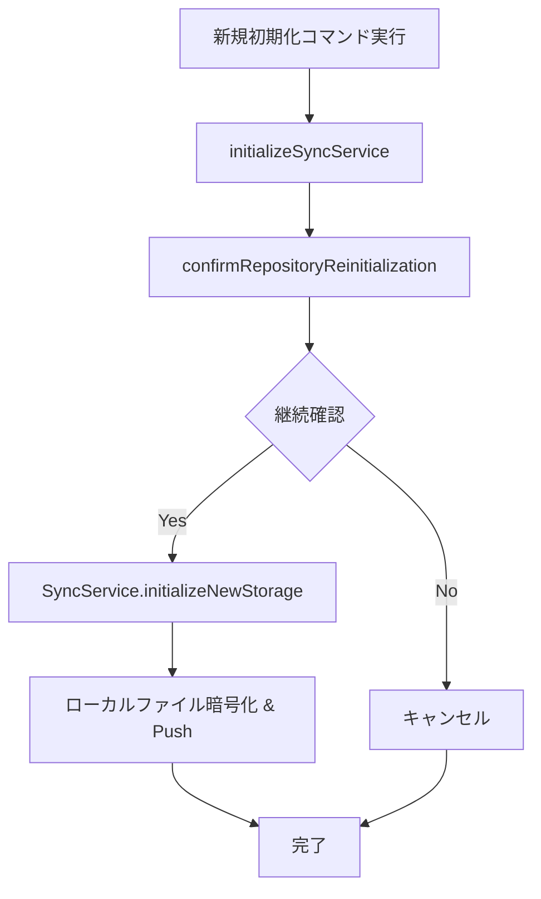
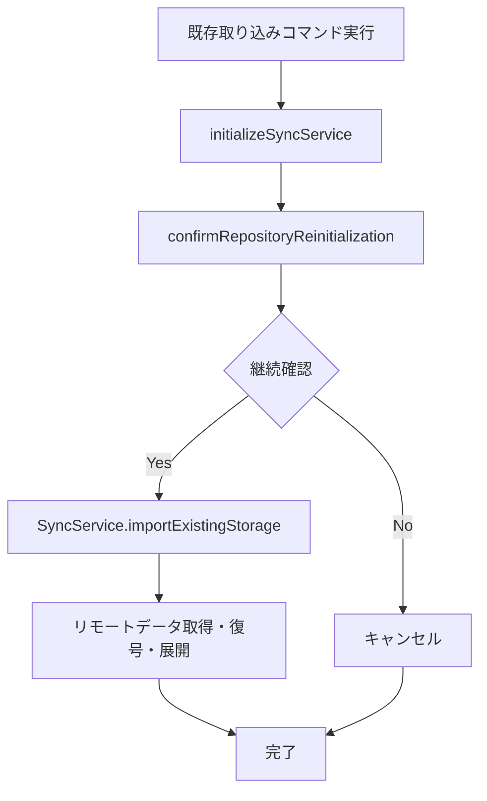
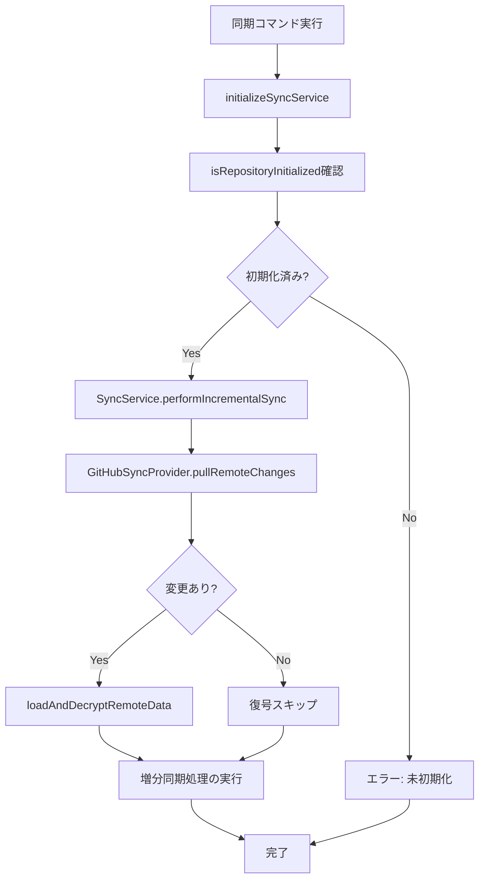

# Secure Notes Sync - 同期処理詳細解析

このドキュメントは、依存性注入アーキテクチャを採用した新しい`SyncService`実装と、`ISyncService`インターフェースに基づく同期・初期化処理の詳細な内容を解析したものです。

## 📋 概要

同期処理は、依存性注入パターンと責務の分離を目的として、以下の3つの主要なコマンドに分割されました。

1.  **`initializeNewStorage`** - 新規リモートストレージを作成し、ローカルのワークスペースをアップロードします。
2.  **`importExistingStorage`** - 既存のリモートストレージを取り込み、ローカルに展開します。
3.  **`performIncrementalSync`** - 既存のリポジトリとローカルの変更点を同期します。

これにより、各処理の責務が明確になり、依存性注入によるテスタビリティの向上、コードの保守性とユーザーエクスペリエンスが向上しました。

## 🏗️ 依存性注入アーキテクチャ

### サービス初期化フロー
```mermaid
graph TD
    A[Extension Activation] --> B[ContainerBuilder.buildDefault]
    B --> C[ServiceLocator.setContainer]
    C --> D[Command Registration]
    D --> E[initializeSyncService]
    E --> F[ConfigManager.createSyncConfig]
    F --> G[SyncServiceFactory.createSyncService(ctx含む)]
    G --> H[Service Ready]
```

### 依存関係
- **ConfigManager**: 設定の構築と検証
- **SyncServiceFactory**: 設定に基づくサービス生成
- **ServiceLocator**: グローバルサービスアクセス

---

## 🔄 `initializeNewStorage` 詳細解析

**ファイル**: `src/SyncService.ts`
**インターフェース**: `ISyncService.initializeNewStorage()`
**役割**: 新規リモートストレージの作成と初期化

### 📊 処理フロー概要



## 🔄 `importExistingStorage` 詳細解析

**ファイル**: `src/SyncService.ts`
**インターフェース**: `ISyncService.importExistingStorage()`
**役割**: 既存リモートストレージの取り込みと展開

### 📊 処理フロー概要



### 🔍 段階別詳細解析

1.  **リモート状態確認**:
    -   `GitHubSyncProvider.getRemoteState()`でリモートの存在と空状態を確認します。
    -   データの有無は `hasRemoteData()` で判定できます。

2.  **新規ストレージ初期化**:
    -   リモートが存在しない場合、`GitHubSyncProvider.initializeNewRemoteRepository()`で初期化し、`LocalObjectManager`で暗号化・保存後、初回プッシュを行います。

3.  **空のリポジトリ初期化**:
    -   リモートは存在するが空の場合、`GitHubSyncProvider.initializeEmptyRemoteRepository()`でローカルのGitリポジトリをセットアップし、同様に暗号化したファイルをプッシュします。

4.  **エラー処理**:
    -   リモートに既にデータが存在する場合は、ユーザーにエラーメッセージを表示し、処理を中断します。

---

## 🔄 `performIncrementalSync` 詳細解析

**ファイル**: `src/SyncService.ts`
**インターフェース**: `ISyncService.performIncrementalSync()`
**役割**: 既存リポジトリとの増分同期

### 📊 処理フロー概要



### 🔍 共通ヘルパー関数

#### `initializeSyncService`
```typescript
async function initializeSyncService(
  context: vscode.ExtensionContext, 
  branchProvider: BranchTreeViewProvider,
  encryptKey: string
) {
  const configManager = ServiceLocator.getConfigManager();
  const syncConfig = await configManager.createSyncConfig(context, encryptKey, branchProvider);
  configManager.validateConfig(syncConfig);
  
  const syncServiceFactory = ServiceLocator.getSyncServiceFactory();
  const syncService = syncServiceFactory.createSyncService(syncConfig, context);
  
  return { syncService, options: { environmentId: syncConfig.environmentId!, encryptionKey: encryptKey } };
}
```

#### `handleRepositoryInitialization`
関数型プログラミングのアプローチを採用し、操作を関数として注入する共通処理パターン。

### 🔍 段階別詳細解析

1.  **前提条件**: このコマンドは、`.secureNotes/remotes`にGitリポジトリが初期化されていることを前提とします。未初期化の場合はエラーメッセージを表示します。

2.  **リモート更新の取得**:
    -   `GitHubSyncProvider.cloneRemoteStorage()` もしくは `pullRemoteChanges()` を呼び出して、ローカルの`.secureNotes/remotes`リポジトリを最新の状態に更新します。

3.  **リモートデータの展開**:
    -   `GitHubSyncProvider.loadAndDecryptRemoteData()`が、更新されたリポジトリ内のインデックスとファイルを元に、ワークスペースのファイルを復元・更新します。

4.  **増分同期処理 (`performTraditionalIncrementalSync`)**:
    -   ここからの処理は、リファクタリング前の既存リポジトリ同期フローと同じです。
    -   ローカルの変��をスキャンして新しいインデックスを作成します。
    -   前回、ローカル、リモートの3つのインデックスを比較し、競合を検出・解決します。
    -   最終的なマージ結果を暗号化して保存し、リモートリポジトリにプッシュします。

---

## 🌐 `GitHubSyncProvider` の役割

`GitHubSyncProvider`は、Git操作を抽象化する役割を担います。`SyncService`からの指示に基づき、以下の主要な操作を実行します。

-   `isInitialized()`: ローカルの初期化状態を確認します。
-   `getRemoteState()` / `hasRemoteData()`: リモートの存在・データ有無を確認します。
-   `initializeNewRemoteRepository()` / `initializeEmptyRemoteRepository()`: 初期化系操作。
-   `cloneRemoteStorage()` / `pullRemoteChanges()`: 取得・更新系操作。
-   `loadAndDecryptRemoteData()`: 暗号化データの復号・展開。
-   `upload()`: `git add`, `commit`, `push` の実行。
