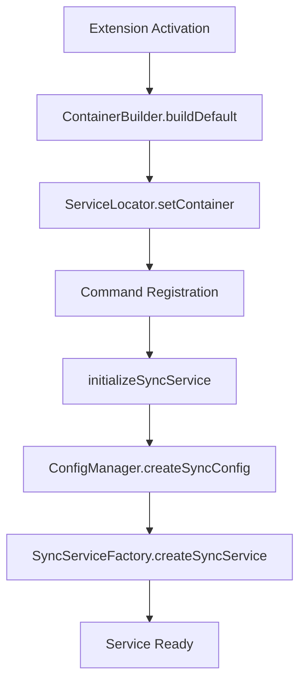
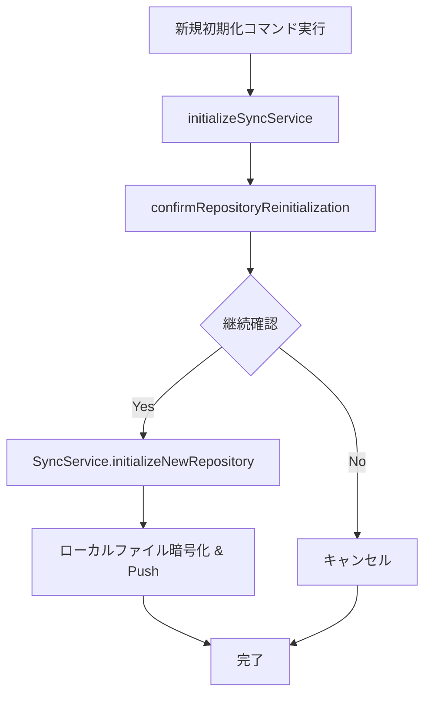
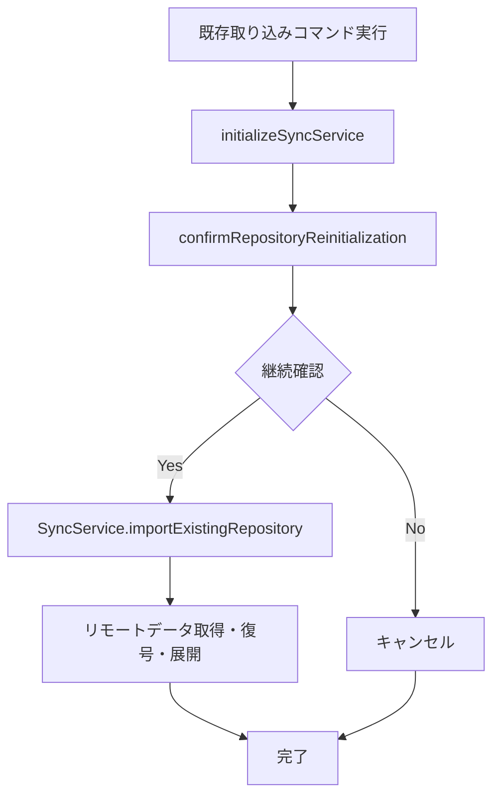
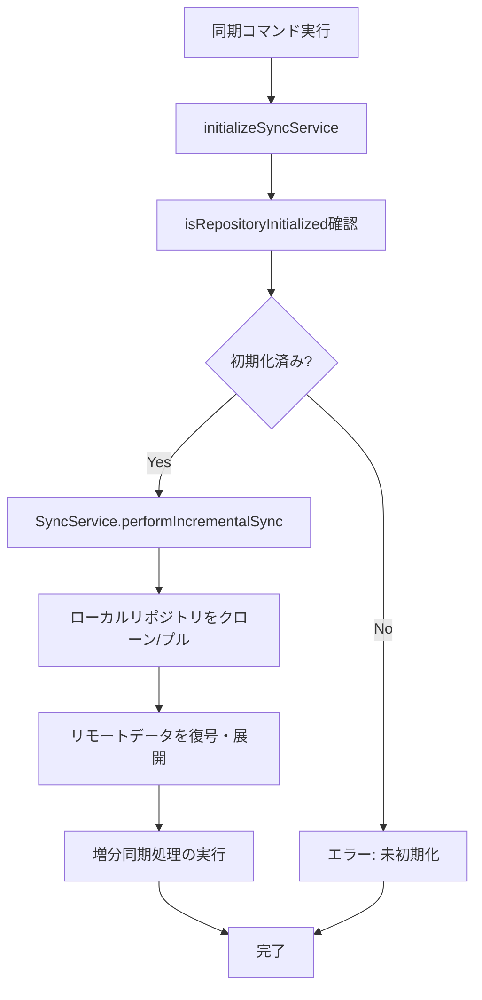

# Secure Notes Sync - 同期処理詳細解析

このドキュメントは、依存性注入アーキテクチャを採用した新しい`SyncService`実装と、`ISyncService`インターフェースに基づく同期・初期化処理の詳細な内容を解析したものです。

## 📋 概要

同期処理は、依存性注入パターンと責務の分離を目的として、以下の3つの主要なコマンドに分割されました。

1.  **`initializeNewRepository`** - 新規リモートリポジトリを作成し、ローカルのワークスペースをアップロードします。
2.  **`importExistingRepository`** - 既存のリモートリポジトリを取り込み、ローカルに展開します。
3.  **`performIncrementalSync`** - 既存のリポジトリとローカルの変更点を同期します。

これにより、各処理の責務が明確になり、依存性注入によるテスタビリティの向上、コードの保守性とユーザーエクスペリエンスが向上しました。

## 🏗️ 依存性注入アーキテクチャ

### サービス初期化フロー


### 依存関係
- **ConfigManager**: 設定の構築と検証
- **SyncServiceFactory**: 設定に基づくサービス生成
- **ServiceLocator**: グローバルサービスアクセス

---

## 🔄 `initializeNewRepository` 詳細解析

**ファイル**: `src/SyncService.ts`
**インターフェース**: `ISyncService.initializeNewRepository(options: SyncOptions)`
**役割**: 新規リモートリポジトリの作成と初期化

### 📊 処理フロー概要



## 🔄 `importExistingRepository` 詳細解析

**ファイル**: `src/SyncService.ts`
**インターフェース**: `ISyncService.importExistingRepository(options: SyncOptions)`
**役割**: 既存リモートリポジトリの取り込みと展開

### 📊 処理フロー概要



### 🔍 段階別詳細解析

1.  **リモート状態確認**:
    -   `GitHubSyncProvider.checkRemoteRepositoryExists()`でリモートリポジトリの有無を確認します。
    -   存在する場合、`checkRemoteRepositoryIsEmpty()`で中身が空かどうかを確認します。

2.  **新規リポジトリ初期化**:
    -   リモートが存在しない場合、`LocalObjectManager`でワークスペースのファイルを暗号化し、`GitHubSyncProvider.initializeNewRemoteRepository()`でローカルにGitリポジトリを作成後、初回プッシュを行います。

3.  **空のリポジトリ初期化**:
    -   リモートは存在するが空の場合、`GitHubSyncProvider.initializeEmptyRemoteRepository()`でローカルのGitリポジトリをセットアップし、同様に暗号化したファイルをプッシュします。

4.  **エラー処理**:
    -   リモートに既にデータが存在する場合は、ユーザーにエラーメッセージを表示し、処理を中断します。

---

## 🔄 `performIncrementalSync` 詳細解析

**ファイル**: `src/SyncService.ts`
**インターフェース**: `ISyncService.performIncrementalSync(options: SyncOptions)`
**役割**: 既存リポジトリとの増分同期

### 📊 処理フロー概要



### 🔍 共通ヘルパー関数

#### `initializeSyncService`
```typescript
async function initializeSyncService(
  context: vscode.ExtensionContext, 
  branchProvider: BranchTreeViewProvider
) {
  const encryptKey = await getAESKey(context);
  const configManager = ServiceLocator.getConfigManager();
  const syncConfig = await configManager.createSyncConfig(context, encryptKey, branchProvider);
  configManager.validateConfig(syncConfig);
  
  const syncServiceFactory = ServiceLocator.getSyncServiceFactory();
  const syncService = syncServiceFactory.createSyncService(syncConfig);
  
  return { syncService, options: { environmentId: syncConfig.environmentId!, encryptionKey: encryptKey } };
}
```

#### `handleRepositoryInitialization`
関数型プログラミングのアプローチを採用し、操作を関数として注入する共通処理パターン。

### 🔍 段階別詳細解析

1.  **前提条件**: このコマンドは、`.secureNotes/remotes`にGitリポジトリが初期化されていることを前提とします。未初期化の場合はエラーメッセージを表示します。

2.  **リモート更新の取得**:
    -   `GitHubSyncProvider.cloneExistingRemoteRepository()`を呼び出し、ローカルの`.secureNotes/remotes`リポジトリを最新の状態に更新します。

3.  **リモートデータの展開**:
    -   `GitHubSyncProvider.loadAndDecryptRemoteData()`が、更新されたリポジトリ内のインデックスとファイルを元に、ワークスペースのファイルを復元・更新します。

4.  **増分同期処理 (`performTraditionalIncrementalSync`)**:
    -   ここからの処理は、リファクタリング前の既存リポジトリ同期フローと同じです。
    -   ローカルの変��をスキャンして新しいインデックスを作成します。
    -   前回、ローカル、リモートの3つのインデックスを比較し、競合を検出・解決します。
    -   最終的なマージ結果を暗号化して保存し、リモートリポジトリにプッシュします。

---

## 🌐 `GitHubSyncProvider` の役割

`GitHubSyncProvider`は、Git操作を抽象化する役割を担います。`SyncService`からの指示に基づき、以下の主要な操作を実行します。

-   `isGitRepositoryInitialized()`: ローカルの初期化状態を確認します。
-   `checkRemoteRepositoryExists()`: `git ls-remote`でリモートの存在を確認します。
-   `checkRemoteRepositoryIsEmpty()`: `ls-remote`の結果が空かで判断します。
-   `initializeNewRemoteRepository()`: `git init`, `git remote add`などを実行します。
-   `cloneExistingRemoteRepository()`: `git clone`または`git pull`を実行します。
-   `upload()`: `git add`, `git commit`, `git push`を実行します。