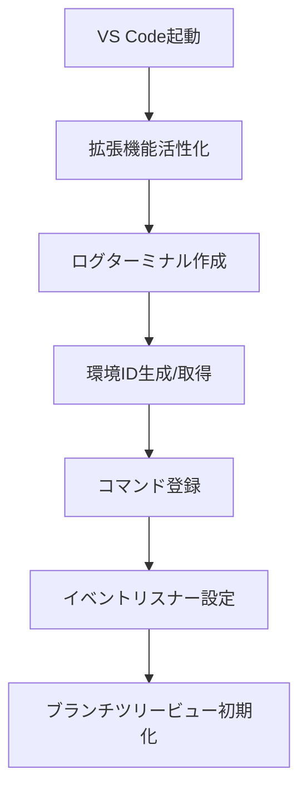
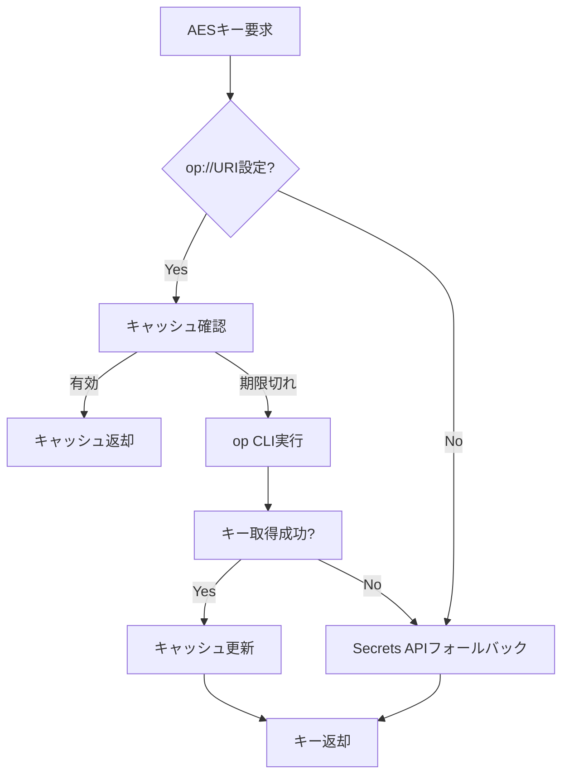
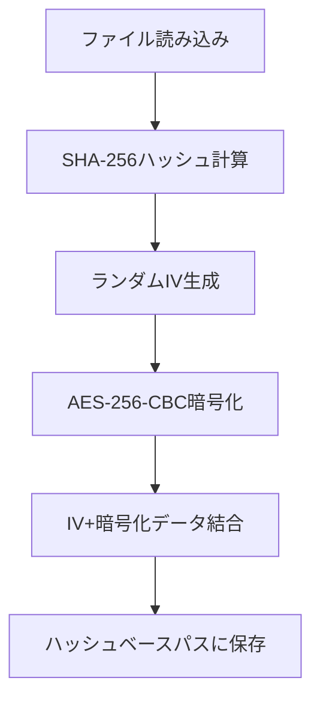
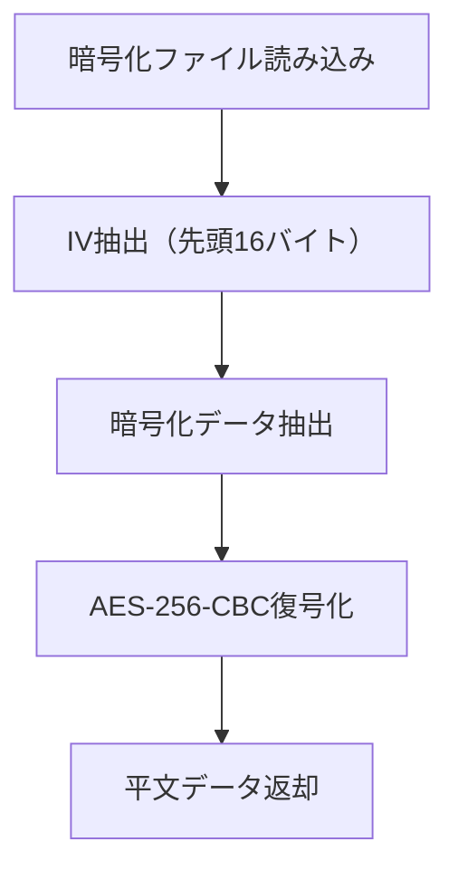
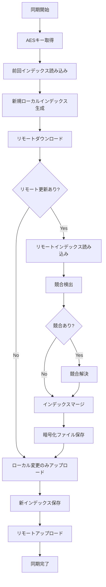
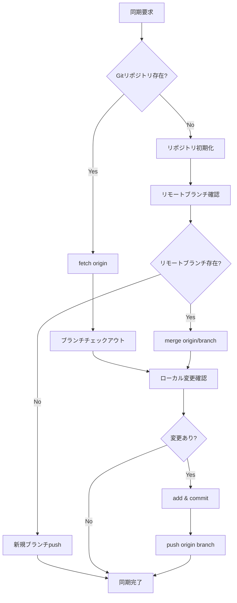
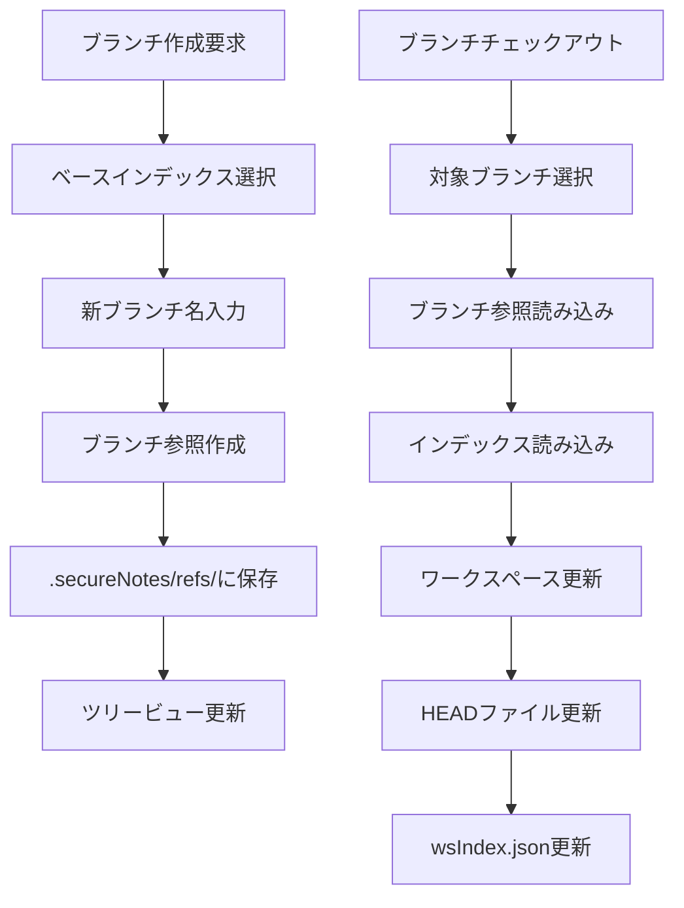
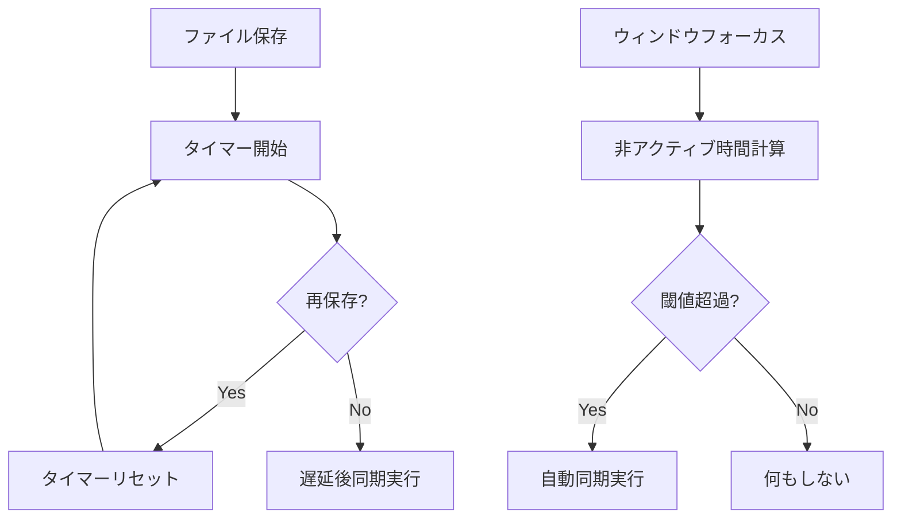

# Secure Notes Sync - 動作仕様書

## 概要

Secure Notes Syncは、VS Code拡張機能として動作し、ワークスペース内のファイルをAES-256-CBC暗号化してGitHubリポジトリと同期するシステムです。ブランチベースのバージョン管理、競合解決、1Password連携によるキー管理機能を提供します。

## アーキテクチャ概要

### 1. **コア構成要素**

- **拡張機能エントリポイント** (`extension.ts`): コマンド登録、イベント処理、AESキー管理
- **ローカルオブジェクト管理** (`LocalObjectManager.ts`): 暗号化、インデックス管理、競合解決
- **GitHub同期プロバイダ** (`GithubProvider.ts`): Git操作によるリモート同期
- **ブランチツリービュー** (`BranchTreeViewProvider.ts`): UI表示とブランチ操作
- **ロガー** (`logger.ts`): ターミナル出力とエラー管理

### 2. **データ構造**

#### インデックスファイル (IndexFile)
```typescript
interface IndexFile {
  uuid: string;           // UUID v7による一意識別子
  environmentId: string;  // 環境ID (ホスト名 + UUID)
  parentUuids: string[];  // 親インデックスのUUID配列
  files: FileEntry[];     // ファイル情報配列
  timestamp: number;      // 作成タイムスタンプ
}
```

#### ファイルエントリ (FileEntry)
```typescript
interface FileEntry {
  path: string;      // ワークスペース相対パス
  hash: string;      // SHA-256ハッシュ値（暗号化前）
  timestamp: number; // 最終更新タイムスタンプ
  deleted?: boolean; // 削除フラグ
}
```

### 3. **ディレクトリ構造**

```
.secureNotes/
├── HEAD                           # 現在のブランチ名
├── wsIndex.json                   # ワークスペースインデックス（平文）
└── remotes/
    ├── refs/                      # ブランチ参照（暗号化UUID）
    │   ├── main                   # メインブランチ参照
    │   └── feature-branch         # 他のブランチ参照
    ├── indexes/                   # インデックスファイル（暗号化）
    │   ├── 01a2b3/               # UUID先頭6文字でディレクトリ分割
    │   │   └── c4d5e6f7...       # 残りのUUID
    │   └── ...
    └── files/                     # ファイルコンテンツ（暗号化）
        ├── ab/                    # ハッシュ先頭2文字でディレクトリ分割
        │   └── cdef123456...      # 残りのハッシュ
        └── ...
```

## 主要機能と処理フロー

### 1. **拡張機能の初期化と活性化**

#### 活性化条件
- ワークスペースに `.secureNotes/wsIndex.json` が存在する場合に自動活性化

#### 初期化処理フロー


#### 環境ID生成
- `ホスト名-UUID` 形式で一意の環境IDを生成
- VS Code のglobalStateに永続化

### 2. **AESキー管理システム**

#### キー取得優先順位
1. 1Password CLI (op://URI設定時)
2. VS Code Secrets API
3. 手動入力

#### 1Password連携フロー


#### キャッシュ管理
- デフォルト30日間のキャッシュ
- 設定可能なタイムアウト（s/m/h/d単位）
- 手動リフレッシュ機能

### 3. **暗号化・復号化システム**

#### 暗号化仕様
- **アルゴリズム**: AES-256-CBC
- **キー**: 64文字のHEX文字列（32バイト）
- **IV**: ファイルごとにランダム生成（16バイト）
- **形式**: `[IV(16bytes)][暗号化データ]`

#### 暗号化処理フロー


#### 復号化処理フロー


#### キー管理
- VS Code Secrets APIによる安全な保存
- 1Password CLIとの連携（op://URI）
- キャッシュ機能（設定可能な有効期限）

### 4. **ファイル同期システム**

#### 同期処理の全体フロー


#### 競合検出アルゴリズム
- **3-way比較**: 前回・ローカル・リモートの状態を比較
- **変更タイプ判定**:
  - `localUpdate`: ローカルのみ変更
  - `remoteUpdate`: リモートのみ変更
  - `localAdd`: ローカルで新規追加
  - `remoteAdd`: リモートで新規追加
  - `localDelete`: ローカルで削除
  - `remoteDelete`: リモートで削除

#### 競合解決戦略
1. **リモート優先**: リモートの変更を採用
2. **ローカル保護**: ローカルファイルを `conflict-local-{timestamp}/` に移動
3. **削除ファイル保護**: 削除されたファイルを `deleted-{timestamp}/` に移動
4. **自動マージ**: タイムスタンプベースの自動選択

### 5. **GitHub同期プロバイダ**

#### Git操作フロー


#### リポジトリ管理
- **初期化**: `.secureNotes/remotes/` をGitリポジトリとして管理
- **ブランチ戦略**: ブランチごとに独立したGitブランチを作成
- **競合解決**: `--allow-unrelated-histories -X theirs` でリモート優先マージ
- **バイナリ扱い**: `.gitattributes` で暗号化ファイルをバイナリ指定

### 6. **ブランチ管理システム**

#### ブランチ操作フロー


#### ブランチ参照管理
- **保存場所**: `.secureNotes/remotes/refs/{branchName}`
- **内容**: 暗号化されたインデックスUUID
- **HEAD管理**: `.secureNotes/HEAD` に現在のブランチ名を保存

#### ツリービュー表示
- **ブランチ一覧**: 折りたたみ可能なツリー構造
- **インデックス履歴**: 各ブランチの履歴を時系列表示
- **コンテキストメニュー**: 右クリックでブランチ操作

### 7. **自動同期システム**

#### 自動同期トリガー
1. **ファイル保存後**: 設定可能な遅延（デフォルト5秒）後に同期
2. **ウィンドウ再フォーカス**: 非アクティブ時間が閾値（デフォルト60秒）を超えた場合
3. **手動実行**: コマンドパレットから明示的に実行

#### 自動同期フロー


#### 設定項目
- `enableAutoSync`: 自動同期の有効/無効
- `saveSyncTimeoutSec`: ファイル保存後の遅延時間
- `inactivityTimeoutSec`: ウィンドウ非アクティブ閾値

### 8. **ログ・エラー管理システム**

#### ログ出力
- **専用ターミナル**: "SecureNoteSync Log" ターミナルに出力
- **タイムスタンプ**: ISO 8601形式のローカル時刻
- **カラー表示**: ANSIカラーコードによる重要度別表示
  - 赤: エラー
  - 緑: 成功・情報
  - 黄: 警告
  - 青: デバッグ情報

#### エラーハンドリング
- **ユーザー通知**: VS Code の通知APIを使用
- **詳細ログ**: ターミナルに詳細なエラー情報を出力
- **リカバリ**: 可能な場合は自動復旧を試行

## 利用可能なコマンド

### 基本操作
- `extension.generateAESKey`: 新しい32バイトAESキーを生成
- `extension.setAESKey`: AESキーを手動設定
- `extension.syncNotes`: 手動同期実行
- `extension.refreshAESKey`: 1PasswordからAESキーを強制再取得

### ユーティリティ
- `extension.copyAESKeyToClipboard`: AESキーをクリップボードにコピー
- `extension.insertCurrentTime`: 現在時刻をエディタに挿入

### ブランチ操作
- `extension.createBranchFromIndex`: 選択したインデックスから新ブランチ作成
- `extension.checkoutBranch`: 選択したブランチにチェックアウト

## 設定項目

### 必須設定
- `SecureNotesSync.gitRemoteUrl`: GitHubリポジトリURL

### オプション設定
- `SecureNotesSync.enableAutoSync`: 自動同期の有効化
- `SecureNotesSync.inactivityTimeoutSec`: 非アクティブ閾値（秒）
- `SecureNotesSync.saveSyncTimeoutSec`: 保存後遅延時間（秒）
- `SecureNotesSync.onePasswordUri`: 1Password CLI URI
- `SecureNotesSync.onePasswordAccount`: 1Passwordアカウント名
- `SecureNotesSync.onePasswordCacheTimeout`: キャッシュ有効期限

## セキュリティ考慮事項

### 暗号化
- **AES-256-CBC**: 業界標準の強力な暗号化
- **ランダムIV**: ファイルごとに異なるIVで暗号化強度を向上
- **キー管理**: VS Code Secrets APIによる安全な保存

### アクセス制御
- **GitHub認証**: SSH/HTTPSによるリポジトリアクセス制御
- **1Password連携**: エンタープライズ環境でのキー管理
- **環境分離**: 環境IDによる複数環境の分離

### データ保護
- **暗号化保存**: すべての機密データを暗号化してGitHubに保存
- **ハッシュ検証**: SHA-256によるファイル整合性確認
- **競合保護**: データ損失を防ぐ競合解決機能

## パフォーマンス最適化

### 効率的な同期
- **差分同期**: 変更されたファイルのみを転送
- **ハッシュベース重複排除**: 同一内容ファイルの重複保存を回避
- **ディレクトリ分割**: ハッシュ/UUIDベースの階層化でファイルシステム負荷軽減

### キャッシュ戦略
- **AESキーキャッシュ**: 1Passwordアクセス頻度の削減
- **インデックスキャッシュ**: ローカルwsIndex.jsonによる高速アクセス
- **タイムスタンプ最適化**: ファイル変更検出の高速化

## 拡張性と将来計画

### 現在の制限
- **単一暗号化キー**: 全データで共通のAESキー使用
- **リモート優先競合解決**: 自動解決による柔軟性の制限
- **GitHub依存**: 単一のストレージプロバイダ

### 将来の拡張可能性
- **マルチプロバイダ**: S3、Azure Blob等への対応
- **高度な競合解決**: 3-wayマージ、手動解決UI
- **チーム機能**: 共有ワークスペース、権限管理
- **バックアップ機能**: 定期的な自動バックアップ
- **監査ログ**: 変更履歴の詳細追跡

---

## 参考: 旧バージョニング仕様(S3ベース)

この仕様書は、元々S3ベースのストレージシステムとして設計されていましたが、現在の実装ではGitHubリポジトリを使用しています。以下は参考として残している旧仕様の概要です。

### 主な違い
- **ストレージ**: S3 → GitHub リポジトリ
- **認証**: IAM → SSH/HTTPS Git認証  
- **同期方式**: 直接S3操作 → Git操作（fetch/merge/push）
- **競合解決**: LWW → 3-way比較 + 自動解決

### 旧仕様の特徴
- Last Write Wins (LWW) による単純な競合解決
- HMACベースのハッシュ生成
- バックグラウンドでの定期的な更新確認
- S3のオブジェクトストレージを直接操作

現在の実装では、これらの概念をGitベースのワークフローに適応させ、より堅牢で標準的なバージョン管理システムを構築しています。
