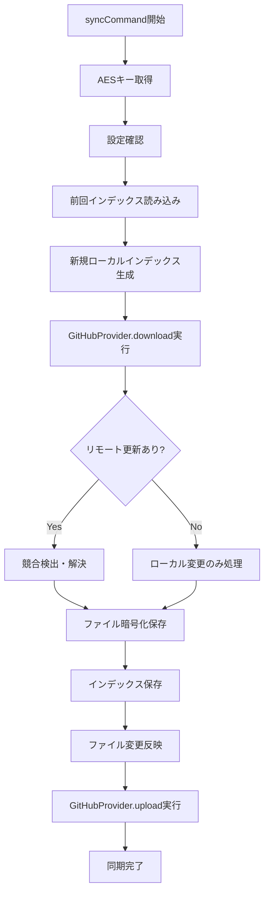
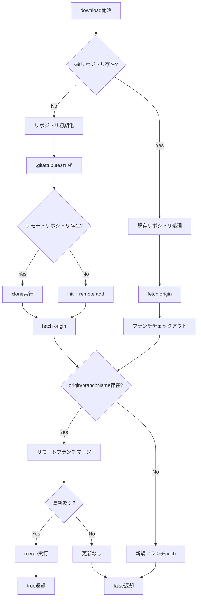
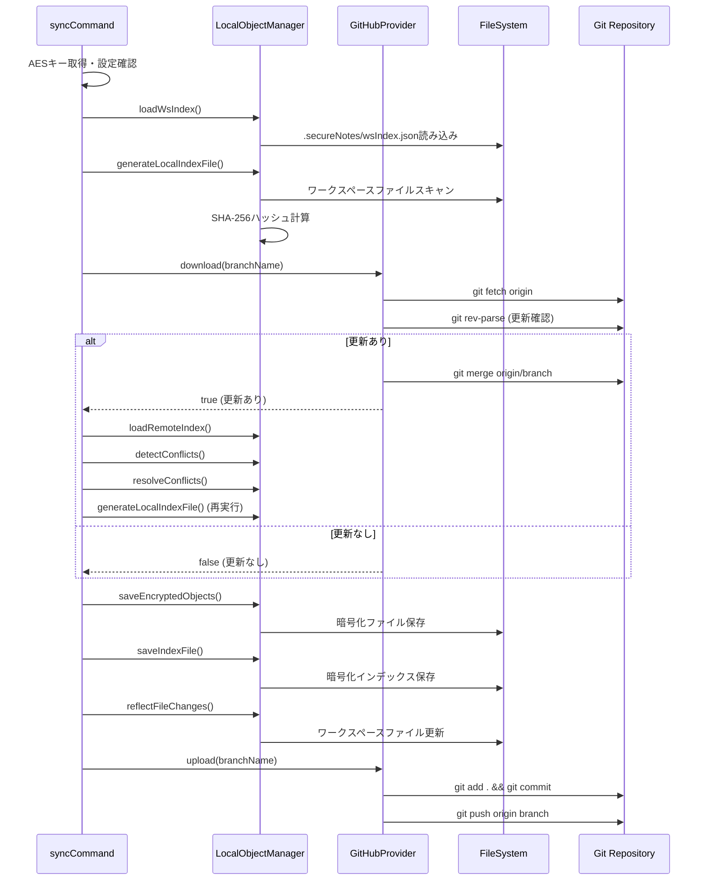

# Secure Notes Sync - 同期処理詳細解析

このドキュメントは、`src/extension.ts`の`syncCommand`と`src/storage/GithubProvider.ts`の`download`メソッドの詳細な処理内容を解析したものです。

## 📋 概要

同期処理は以下の2つの主要コンポーネントで構成されています：

1. **`syncCommand`** - 同期処理の全体制御とローカルファイル管理
2. **`GitHubSyncProvider.download()`** - Git操作によるリモートデータの取得

---

## 🔄 syncCommand 詳細解析

**ファイル**: `src/extension.ts` (行81-176)  
**役割**: 同期処理のメインオーケストレーター

### 📊 処理フロー概要



### 🔍 段階別詳細解析

#### **Phase 1: 初期化・検証 (行84-102)**

```typescript
const encryptKey = await getAESKey(context);
if (!encryptKey) {
  showError("AES Key not set");
  return false;
}

const gitRemoteUrl = vscode.workspace
  .getConfiguration(appName)
  .get<string>("gitRemoteUrl");
if (!gitRemoteUrl) {
  showError("設定でGitHubリポジトリURLを設定してください。");
  return;
}
```

**処理内容**:
- **AESキー取得**: 1Password CLI → VS Code Secrets → 手動入力の優先順位で取得
- **設定検証**: GitHubリポジトリURLの存在確認
- **環境ID設定**: ホスト名+UUIDによる一意識別子の準備

**エラーハンドリング**:
- AESキー未設定時は即座に処理終了
- GitHubリポジトリURL未設定時はエラー表示

#### **Phase 2: ローカル状態の準備 (行103-114)**

```typescript
const options = {
  environmentId: environmentId,
  encryptionKey: encryptKey,
};
const previousIndex = await LocalObjectManager.loadWsIndex(options);
logMessage(`Loaded previous index file: ${previousIndex.uuid}`);
let newLocalIndex = await LocalObjectManager.generateLocalIndexFile(
  previousIndex,
  options
);
showInfo("New local index file created.");
```

**処理内容**:
- **前回インデックス読み込み**: `.secureNotes/wsIndex.json`から前回の状態を取得
- **新規ローカルインデックス生成**: 現在のワークスペース状態をスキャンしてインデックス作成
  - ファイル一覧取得（`node_modules`と`.secureNotes`を除外）
  - SHA-256ハッシュ計算（タイムスタンプ最適化あり）
  - 削除ファイルの検出
  - UUID v7による一意識別子生成

**最適化ポイント**:
- タイムスタンプが同じファイルはハッシュ値を再利用
- 差分検出による効率的な処理

#### **Phase 3: リモート同期・競合処理 (行115-140)**

```typescript
const cloudStorageProvider = new GitHubSyncProvider(gitRemoteUrl);
let updated = false;
const currentBranch = await getCurrentBranchName();
if (await cloudStorageProvider.download(currentBranch)) {
  // リモートに更新があった場合
  const remoteIndex = await LocalObjectManager.loadRemoteIndex(options);
  const conflicts = await LocalObjectManager.detectConflicts(
    previousIndex,
    newLocalIndex,
    remoteIndex
  );
  if (conflicts.length > 0) {
    const conflictsResolved = await LocalObjectManager.resolveConflicts(
      conflicts,
      options
    );
    if (!conflictsResolved) {
      showInfo("Sync aborted due to unresolved conflicts.");
      return true;
    }
  }
  // ローカルとリモートの変更をマージ
  logMessage("Merging local and remote changes...");
  newLocalIndex = await LocalObjectManager.generateLocalIndexFile(
    previousIndex,
    options
  );
  updated = true;
}
```

**処理内容**:
- **現在ブランチ取得**: `.secureNotes/HEAD`から現在のブランチ名を読み取り
- **リモートダウンロード**: `GitHubSyncProvider.download()`を実行
- **競合検出**: 3-way比較（前回・ローカル・リモート）による競合分析
- **競合解決**: 自動解決戦略の適用
- **再インデックス**: 競合解決後の状態を反映した新しいインデックス生成

**競合解決戦略**:
- `remoteUpdate/remoteAdd`: リモート優先採用
- `localUpdate/localDelete`: ローカルを`conflict-local-{timestamp}/`に移動、リモート採用
- `remoteDelete`: ローカル変更があれば`deleted-{timestamp}/`に移動
- `localAdd`: ローカルファイルをそのまま保持

#### **Phase 4: ファイル保存・アップロード (行142-170)**

```typescript
// 2) マージ後のファイルを暗号化保存
updated =
  (await LocalObjectManager.saveEncryptedObjects(
    newLocalIndex.files,
    previousIndex,
    options
  )) || updated;

if (updated) {
  // 3) 新しいインデックスを保存
  await LocalObjectManager.saveIndexFile(
    newLocalIndex,
    currentBranch,
    encryptKey
  );
  await LocalObjectManager.saveWsIndexFile(newLocalIndex, options);
  await LocalObjectManager.reflectFileChanges(
    previousIndex,
    newLocalIndex,
    options,
    false
  );
  branchProvider.refresh();

  // 4) GitHub に push
  await cloudStorageProvider.upload(currentBranch);
  showInfo("Merge completed successfully.");
  return true;
}
```

**処理内容**:
- **暗号化ファイル保存**: 変更されたファイルのみAES-256-CBC暗号化して保存
- **インデックス保存**: 
  - 暗号化されたインデックスを`.secureNotes/remotes/indexes/`に保存
  - ブランチ参照を`.secureNotes/remotes/refs/`に更新
  - ワークスペースインデックスを`.secureNotes/wsIndex.json`に保存
- **ファイル変更反映**: 新規・更新・削除ファイルをワークスペースに反映
- **UI更新**: ブランチツリービューのリフレッシュ
- **リモートアップロード**: GitHubへの変更のpush

**重複排除**:
- 既存のハッシュ値と同じファイルはスキップ
- ハッシュベースのパス分割による効率的な管理

---

## 🌐 GitHubSyncProvider.download() 詳細解析

**ファイル**: `src/storage/GithubProvider.ts` (行28-97)  
**役割**: Git操作によるリモートデータの取得と同期

### 📊 処理フロー概要



### 🔍 段階別詳細解析

#### **Phase 1: リポジトリ状態確認 (行28-34)**

```typescript
public async download(branchName: string): Promise<boolean> {
  const objectDir = remotesDirUri.fsPath;
  // ディレクトリがGitリポジトリかどうかを確認
  const isGitRepo = await this.isGitRepository(objectDir);
  if (!isGitRepo) {
    // Gitリポジトリを初期化
    await this.initializeGitRepo(objectDir, branchName);
```

**処理内容**:
- **対象ディレクトリ**: `.secureNotes/remotes/`
- **Git状態確認**: `git rev-parse --is-inside-work-tree`で確認
- **初期化判定**: Gitリポジトリでない場合は初期化処理へ

#### **Phase 2A: 初期化処理 (行32-59)**

```typescript
// Gitリポジトリを初期化
await this.initializeGitRepo(objectDir, branchName);
// ここで一度リモートをfetchし、origin/branchNameが存在するかチェック
const isRemoteBranchExists = await this.remoteBranchExists(objectDir, branchName);
if (isRemoteBranchExists) {
  // リモートブランチをマージ
  await this.checkoutBranch(objectDir, branchName, true /*createIfNotExist*/);
  // merge origin/branchName (theirs)
  await this.execCmd(this.gitPath, [
    'merge',
    `origin/${branchName}`,
    '--allow-unrelated-histories',
    '-X', 'theirs',
    '-m', `Merge remote ${branchName}`
  ], objectDir);
  logMessageGreen(`初回リポジトリ作成後、リモート${branchName}をマージしました。`);
  return true;
} else {
  // リモートブランチが存在しない → ローカルで空コミットして push
  await this.checkoutBranch(objectDir, branchName, true);
  // 空だとコミットできないので最低限のファイルをコミット
  await this.execCmd(this.gitPath, ['add', '.'], objectDir);
  await this.commitIfNeeded(objectDir, 'Initial commit');
  await this.execCmd(this.gitPath, ['push', '-u', 'origin', branchName], objectDir);
  logMessageGreen(`リモートにブランチ「${branchName}」を新規作成してpushしました。`);
  return false;
}
```

**初期化詳細処理**:

1. **`.gitattributes`作成**: `* binary`でバイナリ扱い設定
2. **リモートリポジトリ確認**: `git ls-remote`で存在確認
3. **clone試行**: 存在する場合は`git clone`実行
4. **手動初期化**: 存在しない場合は`git init` + `git remote add origin`
5. **fetch実行**: `git fetch origin`でリモート情報取得

**ブランチ処理**:
- **リモートブランチ存在**: `--allow-unrelated-histories -X theirs`でマージ
- **リモートブランチ不存在**: 初期コミット作成後push

#### **Phase 2B: 既存リポジトリ処理 (行60-96)**

```typescript
} else {
  // 既存リポジトリの場合
  // 1) fetchしてリモートの更新を取得
  await this.execCmd(this.gitPath, ['fetch', 'origin'], objectDir);

  // 2) origin/branchNameがあるかどうかをチェック
  const isRemoteBranchExists = await this.remoteBranchExists(objectDir, branchName);

  // 3) ローカル側にそのブランチをチェックアウト (なければ作る)
  await this.checkoutBranch(objectDir, branchName, true /* createIfNotExist */);

  if (isRemoteBranchExists) {
    // リモートに更新がある場合はマージしてみる
    const localRef = await this.execCmd(this.gitPath, ['rev-parse', '--verify', branchName], objectDir);
    const remoteRef = await this.execCmd(this.gitPath, ['rev-parse', '--verify', `origin/${branchName}`], objectDir);

    if (localRef.stdout.trim() === remoteRef.stdout.trim()) {
      logMessage(`リモートに更新はありません（${branchName}ブランチ）。`);
      return false;
    }
    // merge origin/branchName
    await this.execCmd(this.gitPath, [
      'merge',
      `origin/${branchName}`,
      '--allow-unrelated-histories',
      '-X', 'theirs',
      '-m', `Merge remote ${branchName}`
    ], objectDir);
    logMessageGreen(`既存リポジトリでorigin/${branchName}をマージしました。`);
    return true;
  } else {
    // リモートにbranchがない → 新規としてpush
    logMessageBlue(`リモートに ${branchName} が存在しないので新規pushします。`);
    await this.execCmd(this.gitPath, ['push', '-u', 'origin', branchName], objectDir);
    return false;
  }
}
```

**既存リポジトリ処理**:

1. **リモート更新取得**: `git fetch origin`
2. **ブランチ存在確認**: `git rev-parse --verify origin/branchName`
3. **ローカルブランチ準備**: 存在しなければ`git checkout -b`で作成
4. **更新確認**: ローカルとリモートのコミットハッシュ比較
5. **マージ実行**: 更新がある場合は`--allow-unrelated-histories -X theirs`でマージ
6. **新規push**: リモートブランチが存在しない場合

#### **Phase 3: Git操作ヘルパー関数群**

**`execCmd()` - Git コマンド実行**:
```typescript
private async execCmd(cmd: string, args: string[], cwd: string): Promise<{ stdout: string, stderr: string }> {
  return new Promise((resolve, reject) => {
    cp.execFile(cmd, args, { cwd: cwd }, (error, stdout, stderr) => {
      if (error) {
        reject(new Error(`execFile error:${cmd} ${args.join(' ')} \nstdout: '${stdout}'\nstderr: '${stderr}'`));
      } else {
        logMessage(`execFile:${path.basename(cmd)} ${args.join(' ')} `);
        if (stdout !== '') { logMessage(stdout); }
        if (stderr !== '') { logMessageRed(stderr); }
        resolve({ stdout, stderr });
      }
    });
  });
}
```

**その他のヘルパー関数**:
- **`isGitRepository()`**: `git rev-parse --is-inside-work-tree`で確認
- **`remoteBranchExists()`**: `git rev-parse --verify origin/branchName`で確認
- **`localBranchExists()`**: `git rev-parse --verify branchName`で確認
- **`checkoutBranch()`**: 存在確認後に`git checkout`または`git checkout -b`
- **`commitIfNeeded()`**: `git status --porcelain`で差分確認後コミット

---

## 🔄 同期処理の相互作用

### データフロー詳細



### 🔒 セキュリティ考慮事項

#### **暗号化処理**:
- **アルゴリズム**: AES-256-CBC
- **IV**: ファイルごとにランダム生成（16バイト）
- **キー管理**: VS Code Secrets API + 1Password CLI連携
- **データ形式**: `[IV(16bytes)][暗号化データ]`

#### **Git操作のセキュリティ**:
- **認証**: SSH/HTTPS Git認証に依存
- **バイナリ扱い**: `.gitattributes`で暗号化ファイルをバイナリ指定
- **競合解決**: `--allow-unrelated-histories -X theirs`でリモート優先

### ⚡ パフォーマンス最適化

#### **効率化ポイント**:
1. **ハッシュベース重複排除**: 同一ハッシュファイルの重複保存回避
2. **タイムスタンプ最適化**: 変更されていないファイルのハッシュ再利用
3. **ディレクトリ分割**: ハッシュ/UUID先頭文字によるディレクトリ階層化
4. **差分同期**: 変更されたファイルのみ処理

#### **Git操作最適化**:
1. **fetch最小化**: 必要時のみリモート取得
2. **コミット最適化**: 差分がある場合のみコミット実行
3. **ブランチ管理**: ローカルブランチ存在確認による無駄な操作回避

### 🚨 エラーハンドリング

#### **syncCommand**:
- AESキー未設定時の即座終了
- GitHubリポジトリURL未設定時のエラー表示
- 競合解決失敗時の処理中断
- 例外発生時のエラーメッセージ表示

#### **GitHubProvider.download()**:
- Git実行ファイル未発見時の例外
- リモートリポジトリアクセス失敗時のフォールバック
- Git操作失敗時の詳細エラー情報出力
- ブランチ操作失敗時の適切な処理

---

## 📈 処理性能指標

### **同期処理時間の要因**:
1. **ファイル数**: ワークスペース内のファイル数に比例
2. **ファイルサイズ**: 暗号化・復号化処理時間
3. **ネットワーク**: Git操作（fetch/push）の通信時間
4. **競合数**: 競合検出・解決処理の複雑さ

### **メモリ使用量**:
- **インデックスファイル**: JSON形式でメモリ上に展開
- **暗号化バッファ**: ファイルサイズ + IV(16bytes)
- **Git操作**: 外部プロセスによる処理

---

この詳細解析により、同期処理の全体像と各段階での具体的な処理内容が明確になります。トラブルシューティングや機能拡張時の参考資料として活用できます。