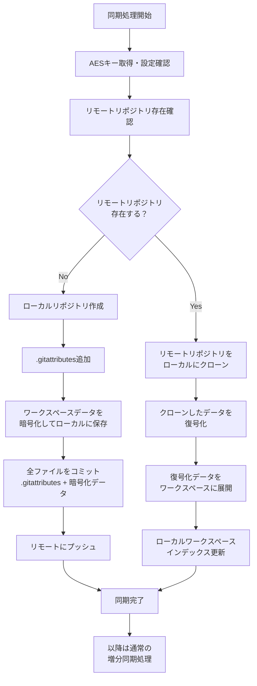

# Secure Notes Sync - 同期処理再設計仕様書

## 📋 概要

本ドキュメントは、Secure Notes Syncの初期同期処理における問題点を解決するための再設計仕様書です。現在のローカルリポジトリ初期化によるコンフリクト問題を解決し、より単純で確実な同期処理を実現します。

## 🚨 現在の問題点

### 問題の詳細
現在の`GithubProvider.ts`の`initializeGitRepo`メソッド（167-183行）では以下の問題が発生しています：

1. **初期化プロセス**:
   - `.gitattributes`ファイルを作成
   - `git init`でローカルリポジトリを初期化
   - `git add`と`git commit`で初期コミットを実行

2. **コンフリクト発生**:
   - リモートリポジトリに同じファイル（`.gitattributes`等）が既に存在する場合
   - ローカルの初期コミットとリモートの既存ファイルでマージコンフリクトが発生
   - 同期処理が失敗する

### 根本原因
- リモートリポジトリの存在確認を行わずにローカル初期化を実行
- 既存リモートデータとの整合性を考慮しない設計

## 🎯 改善案の設計方針

### 基本原則
1. **リモート優先**: リモートリポジトリが存在する場合は、その状態を基準とする
2. **コンフリクト回避**: 初期化時のマージコンフリクトを根本的に防ぐ
3. **処理の単純化**: 明確な分岐処理による理解しやすいフロー
4. **データ整合性**: 既存データの確実な復元と新規データの適切な初期化

### 新しい処理フロー概要
```
リモート存在確認 → 分岐処理
├─ 存在しない → ローカル作成 → リモートプッシュ
└─ 存在する → リモートクローン → データ復号化・展開
```

## 🔄 詳細処理フロー

### フローチャート


### 処理ステップ詳細

#### Phase 1: 初期化・検証
```typescript
// 1. AESキー取得と設定確認
const encryptKey = await getAESKey(context);
const gitRemoteUrl = vscode.workspace.getConfiguration('SecureNotesSync').get<string>('gitRemoteUrl');

// 2. 必要なディレクトリ構造の確認・作成
await ensureDirectoryStructure();
```

#### Phase 2: リモートリポジトリ存在確認
```typescript
/**
 * リモートリポジトリの存在を確認
 * @returns {Promise<boolean>} 存在する場合true、しない場合false
 */
async checkRemoteRepositoryExists(): Promise<boolean> {
    try {
        // git ls-remote でリモートリポジトリの存在を確認
        await this.execCmd(this.gitPath, ['ls-remote', this.gitRemoteUrl], tempDir);
        logMessageGreen(`リモートリポジトリが存在します: ${this.gitRemoteUrl}`);
        return true;
    } catch (error) {
        logMessageBlue(`リモートリポジトリが存在しません: ${this.gitRemoteUrl}`);
        return false;
    }
}
```

#### Phase 3A: リモートリポジトリが存在しない場合
```typescript
/**
 * 新規リモートリポジトリの初期化処理
 * @param branchName 初期ブランチ名
 */
async initializeNewRemoteRepository(branchName: string): Promise<void> {
    const localRepoDir = remotesDirUri.fsPath;
    
    // 1. ローカルリポジトリ初期化
    await this.execCmd(this.gitPath, ['init'], localRepoDir);
    await this.execCmd(this.gitPath, ['remote', 'add', 'origin', this.gitRemoteUrl], localRepoDir);
    
    // 2. .gitattributes作成（暗号化ファイルをバイナリ扱い）
    const gitattributesUri = vscode.Uri.joinPath(remotesDirUri, '.gitattributes');
    await vscode.workspace.fs.writeFile(
        gitattributesUri, 
        new TextEncoder().encode('* binary\n')
    );
    
    // 3. ワークスペースの既存ファイルを暗号化してローカルリポジトリに保存
    await this.encryptAndSaveWorkspaceFiles(localRepoDir);
    
    // 4. 全ファイル（.gitattributes + 暗号化データ）をコミット
    await this.execCmd(this.gitPath, ['add', '.'], localRepoDir);
    await this.execCmd(this.gitPath, ['commit', '-m', 'Initial commit: Setup secure notes with existing workspace data'], localRepoDir);
    
    // 5. リモートにプッシュ（完全な状態で）
    await this.execCmd(this.gitPath, ['push', '-u', 'origin', branchName], localRepoDir);
    
    logMessageGreen(`新規リモートリポジトリを初期化しました（ワークスペースデータ含む）: ${branchName}ブランチ`);
}
```

#### Phase 3B: リモートリポジトリが存在する場合
```typescript
/**
 * 既存リモートリポジトリのクローン処理
 * @param branchName 対象ブランチ名
 */
async cloneExistingRemoteRepository(branchName: string): Promise<void> {
    const localRepoDir = remotesDirUri.fsPath;
    
    // 1. リモートリポジトリをクローン
    await this.execCmd(this.gitPath, ['clone', this.gitRemoteUrl, '.'], localRepoDir);
    
    // 2. 指定ブランチをチェックアウト（存在しない場合は作成）
    const remoteBranchExists = await this.remoteBranchExists(localRepoDir, branchName);
    if (remoteBranchExists) {
        await this.execCmd(this.gitPath, ['checkout', branchName], localRepoDir);
    } else {
        await this.execCmd(this.gitPath, ['checkout', '-b', branchName], localRepoDir);
    }
    
    // 3. クローンしたデータを復号化してワークスペースに展開
    await this.loadAndDecryptRemoteData(localRepoDir);
    
    logMessageGreen(`既存リモートリポジトリをクローンしました: ${branchName}ブランチ`);
}
```

#### Phase 4A: ワークスペースデータ暗号化・保存処理（新規リポジトリの場合）
```typescript
/**
 * ワークスペースファイルを暗号化してローカルリポジトリに保存
 * @param localRepoDir ローカルリポジトリディレクトリ
 */
async encryptAndSaveWorkspaceFiles(localRepoDir: string): Promise<void> {
    try {
        // 1. 現在のワークスペースファイルをスキャン
        const workspaceFiles = await this.scanWorkspaceFiles();
        
        if (workspaceFiles.length === 0) {
            logMessage('ワークスペースに暗号化対象ファイルがありません。');
            return;
        }
        
        // 2. 新しいインデックスを作成
        const newIndex = await this.createNewIndex(workspaceFiles);
        
        // 3. ファイルを暗号化して保存
        for (const fileEntry of newIndex.files) {
            await this.encryptAndSaveFile(localRepoDir, fileEntry);
        }
        
        // 4. インデックスを暗号化して保存
        await this.saveEncryptedIndex(localRepoDir, newIndex);
        
        // 5. ワークスペースインデックスを更新
        await this.updateWorkspaceIndex(newIndex);
        
        logMessage(`${workspaceFiles.length}個のファイルを暗号化してローカルリポジトリに保存しました。`);
        
    } catch (error) {
        logMessageRed(`ワークスペースデータ暗号化・保存処理でエラーが発生しました: ${error}`);
        throw error;
    }
}

/**
 * ワークスペース内の対象ファイルをスキャン
 * @returns {Promise<string[]>} ファイルパス配列
 */
async scanWorkspaceFiles(): Promise<string[]> {
    const workspaceFiles: string[] = [];
    const workspaceUri = vscode.workspace.workspaceFolders?.[0]?.uri;
    
    if (!workspaceUri) {
        return workspaceFiles;
    }
    
    // .secureNotes ディレクトリを除外してファイルをスキャン
    const files = await vscode.workspace.findFiles(
        '**/*',
        '{.secureNotes/**,.git/**,node_modules/**}'
    );
    
    for (const fileUri of files) {
        const relativePath = vscode.workspace.asRelativePath(fileUri);
        workspaceFiles.push(relativePath);
    }
    
    return workspaceFiles;
}

/**
 * 新規インデックスファイルを作成
 * @param filePaths ファイルパス配列
 * @returns {Promise<IndexFile>} 新規インデックス
 */
async createNewIndex(filePaths: string[]): Promise<IndexFile> {
    const fileEntries: FileEntry[] = [];
    
    for (const filePath of filePaths) {
        const fileUri = vscode.Uri.joinPath(vscode.workspace.workspaceFolders![0].uri, filePath);
        const content = await vscode.workspace.fs.readFile(fileUri);
        const hash = await this.calculateFileHash(content);
        const stat = await vscode.workspace.fs.stat(fileUri);
        
        fileEntries.push({
            path: filePath,
            hash: hash,
            size: content.length,
            lastModified: stat.mtime
        });
    }
    
    return {
        uuid: this.generateUUID(),
        environmentId: await this.getEnvironmentId(),
        parentUuids: [], // 新規作成なので親は存在しない
        files: fileEntries,
        timestamp: Date.now()
    };
}
```

#### Phase 4B: データ復号化・展開処理（既存リポジトリの場合）
```typescript
/**
 * クローンしたリモートデータを復号化してワークスペースに展開
 * @param repoDir ローカルリポジトリディレクトリ
 */
async loadAndDecryptRemoteData(repoDir: string): Promise<void> {
    try {
        // 1. リモートのインデックスファイルを読み込み
        const remoteIndexes = await this.loadRemoteIndexes(repoDir);
        
        if (remoteIndexes.length === 0) {
            logMessage('リモートにインデックスファイルが存在しません。空のリポジトリです。');
            return;
        }
        
        // 2. 最新のインデックスを特定
        const latestIndex = this.findLatestIndex(remoteIndexes);
        logMessage(`最新インデックスを特定: ${latestIndex.uuid}`);
        
        // 3. インデックス内のファイル情報を基に暗号化ファイルを復号化
        for (const fileEntry of latestIndex.files) {
            await this.decryptAndRestoreFile(repoDir, fileEntry);
        }
        
        // 4. ローカルワークスペースインデックスを更新
        await this.updateWorkspaceIndex(latestIndex);
        
        logMessageGreen(`${latestIndex.files.length}個のファイルをワークスペースに復元しました。`);
        
    } catch (error) {
        logMessageRed(`データ復号化・展開処理でエラーが発生しました: ${error}`);
        throw error;
    }
}

/**
 * 個別ファイルの復号化・復元処理
 * @param repoDir ローカルリポジトリディレクトリ
 * @param fileEntry ファイルエントリ情報
 */
async decryptAndRestoreFile(repoDir: string, fileEntry: FileEntry): Promise<void> {
    try {
        // 1. 暗号化ファイルの読み込み
        const encryptedFilePath = this.getEncryptedFilePath(repoDir, fileEntry.hash);
        const encryptedContent = await vscode.workspace.fs.readFile(vscode.Uri.file(encryptedFilePath));
        
        // 2. ファイル内容の復号化
        const decryptedContent = await this.decryptContent(encryptedContent, this.aesKey);
        
        // 3. ワークスペースにファイルを復元
        const workspaceFilePath = vscode.Uri.joinPath(this.workspaceUri, fileEntry.path);
        
        // ディレクトリが存在しない場合は作成
        const parentDir = vscode.Uri.joinPath(workspaceFilePath, '..');
        await vscode.workspace.fs.createDirectory(parentDir);
        
        // ファイルを書き込み
        await vscode.workspace.fs.writeFile(workspaceFilePath, decryptedContent);
        
        logMessage(`復元完了: ${fileEntry.path}`);
        
    } catch (error) {
        logMessageRed(`ファイル復元エラー [${fileEntry.path}]: ${error}`);
        throw error;
    }
}

/**
 * リモートインデックスファイルの読み込み
 * @param repoDir ローカルリポジトリディレクトリ
 * @returns {Promise<IndexFile[]>} インデックスファイル配列
 */
async loadRemoteIndexes(repoDir: string): Promise<IndexFile[]> {
    const indexesDir = path.join(repoDir, 'indexes');
    const indexes: IndexFile[] = [];
    
    try {
        const indexFiles = await vscode.workspace.fs.readDirectory(vscode.Uri.file(indexesDir));
        
        for (const [fileName, fileType] of indexFiles) {
            if (fileType === vscode.FileType.File) {
                const indexFilePath = path.join(indexesDir, fileName);
                const encryptedContent = await vscode.workspace.fs.readFile(vscode.Uri.file(indexFilePath));
                const decryptedContent = await this.decryptContent(encryptedContent, this.aesKey);
                const indexData = JSON.parse(new TextDecoder().decode(decryptedContent)) as IndexFile;
                indexes.push(indexData);
            }
        }
        
        return indexes;
    } catch (error) {
        logMessage(`インデックス読み込みエラー: ${error}`);
        return [];
    }
}

/**
 * 最新のインデックスファイルを特定
 * @param indexes インデックスファイル配列
 * @returns {IndexFile} 最新のインデックスファイル
 */
findLatestIndex(indexes: IndexFile[]): IndexFile {
    if (indexes.length === 0) {
        throw new Error('インデックスファイルが存在しません');
    }
    
    // タイムスタンプで最新を特定
    return indexes.reduce((latest, current) => 
        current.timestamp > latest.timestamp ? current : latest
    );
}

/**
 * ワークスペースインデックスの更新
 * @param latestIndex 最新のインデックスファイル
 */
async updateWorkspaceIndex(latestIndex: IndexFile): Promise<void> {
    const wsIndexPath = vscode.Uri.joinPath(this.secureNotesDir, 'wsIndex.json');
    const wsIndexContent = JSON.stringify(latestIndex, null, 2);
    await vscode.workspace.fs.writeFile(wsIndexPath, new TextEncoder().encode(wsIndexContent));
    logMessage('ワークスペースインデックスを更新しました。');
}
```

## 🔧 実装が必要な新しいメソッド

### GitHubSyncProvider クラス
1. `checkRemoteRepositoryExists()`: リモートリポジトリ存在確認
2. `initializeNewRemoteRepository()`: 新規リモートリポジトリ初期化
3. `cloneExistingRemoteRepository()`: 既存リモートリポジトリクローン
4. `loadAndDecryptRemoteData()`: クローンデータの復号化・展開
5. `encryptAndSaveWorkspaceFiles()`: ワークスペースファイルの暗号化・保存

### LocalObjectManager クラス
1. `decryptAndRestoreFile()`: 個別ファイルの復号化・復元
2. `loadRemoteIndexes()`: リモートインデックスファイル読み込み
3. `findLatestIndex()`: 最新インデックス特定
4. `updateWorkspaceIndex()`: ワークスペースインデックス更新
5. `scanWorkspaceFiles()`: ワークスペースファイルスキャン
6. `createNewIndex()`: 新規インデックス作成
7. `encryptAndSaveFile()`: 個別ファイルの暗号化・保存
8. `saveEncryptedIndex()`: 暗号化インデックス保存

## 📈 改善されるメリット

### 1. コンフリクト回避
- **問題解決**: リモートが存在する場合はクローンするため、初期コミットでのコンフリクトが発生しない
- **安全性向上**: マージコンフリクトによる同期失敗を根本的に防ぐ

### 2. 処理の単純化
- **明確な分岐**: リモート存在確認→クローンorプッシュの明確な処理分岐
- **理解しやすさ**: 処理フローが直感的で保守性が向上

### 3. データ整合性
- **確実な復元**: クローン時に既存のリモートデータを正しくワークスペースに復元
- **状態の一貫性**: リモートとローカルの状態を確実に同期
- **完全な初期化**: 新規作成時もワークスペースデータを含めて完全な状態でリモートに保存

### 4. 初期化の確実性
- **環境非依存**: リモートの状態に関係なく、確実に同期環境を構築
- **エラー処理**: 各段階での適切なエラーハンドリング
- **一貫性保証**: 新規・既存どちらの場合も最終的にリモートとローカルが同じ状態になる

## 🔄 既存コードとの互換性

### 変更が必要な箇所
1. **`GithubProvider.ts`**:
   - `download()`メソッドの初期化部分を新しいフローに置き換え
   - 新しいメソッドの追加

2. **`LocalObjectManager.ts`**:
   - データ復号化・展開メソッドの追加
   - インデックス管理メソッドの拡張

### 既存機能への影響
- **増分同期**: 既存の増分同期処理は変更なし
- **ブランチ管理**: 既存のブランチ操作は変更なし
- **暗号化処理**: 既存の暗号化・復号化ロジックは変更なし

## 🧪 テストケース

### 1. 新規リポジトリ初期化テスト
```typescript
// リモートリポジトリが存在しない場合のテスト
test('新規リモートリポジトリの初期化', async () => {
    // Given: リモートリポジトリが存在しない
    // When: 同期処理を実行
    // Then: ローカル初期化→リモートプッシュが実行される
});
```

### 2. 既存リポジトリクローンテスト
```typescript
// リモートリポジトリが存在する場合のテスト
test('既存リモートリポジトリのクローン', async () => {
    // Given: リモートリポジトリに暗号化データが存在
    // When: 同期処理を実行
    // Then: クローン→復号化→ワークスペース展開が実行される
});
```

### 3. データ復号化テスト
```typescript
// 暗号化データの復号化テスト
test('クローンデータの復号化・展開', async () => {
    // Given: 暗号化されたファイルとインデックス
    // When: 復号化処理を実行
    // Then: 正しくワークスペースにファイルが復元される
});
```

## 📝 実装スケジュール

### Phase 1: 基盤メソッド実装
- [ ] `checkRemoteRepositoryExists()`
- [ ] `initializeNewRemoteRepository()`
- [ ] `cloneExistingRemoteRepository()`

### Phase 2: データ処理メソッド実装
- [ ] `loadAndDecryptRemoteData()`
- [ ] `decryptAndRestoreFile()`
- [ ] `loadRemoteIndexes()`

### Phase 3: 統合・テスト
- [ ] 既存`download()`メソッドの置き換え
- [ ] 単体テストの実装
- [ ] 統合テストの実行

### Phase 4: ドキュメント更新
- [ ] 技術仕様書の更新
- [ ] ユーザーガイドの更新
- [ ] トラブルシューティングガイドの更新

## 🔍 注意事項

### セキュリティ考慮事項
- AESキーの適切な管理と保護
- 復号化処理中のメモリ管理
- 一時ファイルの適切な削除

### パフォーマンス考慮事項
- 大量ファイルのクローン・復号化時間
- メモリ使用量の最適化
- 進捗表示の実装

### エラーハンドリング
- ネットワークエラー時の適切な処理
- 復号化失敗時のロールバック
- 部分的な復元失敗時の継続処理

---

この再設計により、Secure Notes Syncの初期同期処理がより安全で確実なものになり、ユーザーエクスペリエンスが大幅に向上します。